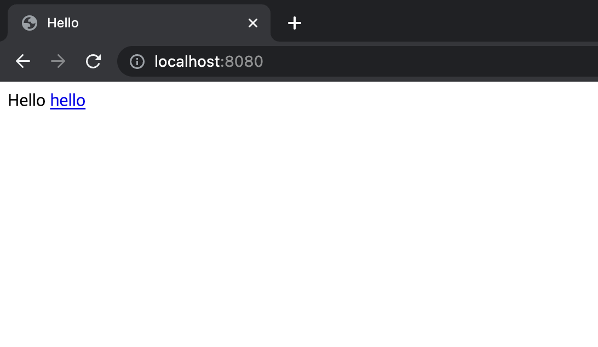

#View 환경설정 (Welcome 페이지 만들기)

현재 만든 프로젝트는 localhost로 접근 시 404페이지가 노출됨. 웹앱 접근 시 노출될 수 있는 페이지를 만들자.

먼저 resource/static 폴더안에 index.html 파일을 생성.
```html
<!DOCTYPE HTML>
<html>
<head>
    <title>Hello</title>
    <meta http-equiv="Content-Type" content="text/html; charset=UTF-8">
</head>
<body>
Hello
<a href="/hello">hello</a>
</body>
</html>
```

작성 후 접속 시 위 html 파일이 나타나게 됨.


spring boot는 스프링을 편리하 사용할 수 있도록 생태계를 감싼 것이라 그 자체로 굉장히 방대함. 그렇기 때문에 자료를 잘 찾는 능력이 중요함.
spring.io 에서 reference를 잘 찾을 수 있어야 한다! (https://docs.spring.io)

이제 실제 프로그램 동작을 위해 controller를 만든다. hello.hellospring 에서 controller 패키지를 만든 후 HelloController.java를 생성.
```java
package hello.hellospring.controller;

import org.springframework.stereotype.Controller;
import org.springframework.ui.Model;
import org.springframework.web.bind.annotation.GetMapping;

@Controller
public class HelloController {

    @GetMapping("hello")
    public String hello (Model model){
        model.addAttribute("data", "hello!");
        return "hello";
    }
}
```

그리고 resouece/templates 에 hello.html 을 만들고 아래와 같이 입력해준다.
```html
<!DOCTYPE HTML>
<html xmlns:th="http://www.thymeleaf.org">
<head>
    <title>Hello</title>
    <meta http-equiv="Content-Type", content="text/html; charset=UTF-8" />
</head>
<body>
<p th:text="'안녕하세요. ' + ${data}">안녕하세요. 손님</p>
</body>

</html>
```

그 후 localhost:8080/hello 를 입력하면 아래와 같이 나온다.


위 처럼 동작하는 원리는 다음과 같다.
```java
@Controller
public class HelloController {
    
    @GetMapping("hello")    // hello라는 엔드포인트로 접근하면 내장 톰캣서버를 거쳐 해당 컨트롤러가 동작.
    public String hello (Model model){  // 이 메소드는 Model이라는 객체를 받는데, 이건 스프링에서 만들어서 넣어준다. 
        model.addAttribute("data", "hello!");   // 모델 안에 data 라는 key로 hello! 라는 값을 세팅해준다.
        return "hello"; // resources:templates/hello.html 파일을 호출한다. 이때 이 화면에 Model에 세팅한 값을 넘겨준다.
    }
}
```
스프링의 컨트롤러에서 return 값을 String으로 반환하면 뷰 리졸버(ViewResolver)가 화면을 찾아서 처리해준다.
- 스프링부트 템플릿 엔진은 기본적으로 viewName 매핑이 된다.
- 즉, resources:templates/{viewName}.html 을 호출하게 해주는 것이다.

위와 같은 경우는 resources:templates/hello.html 파일을 호출하게 된 것이다.