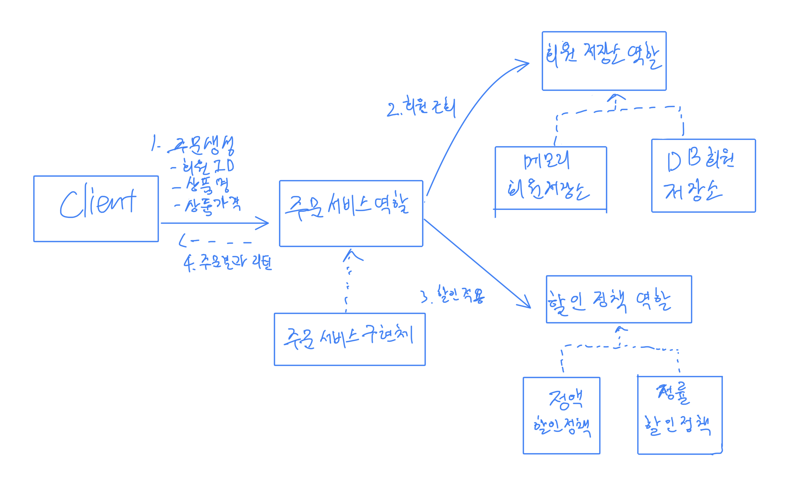
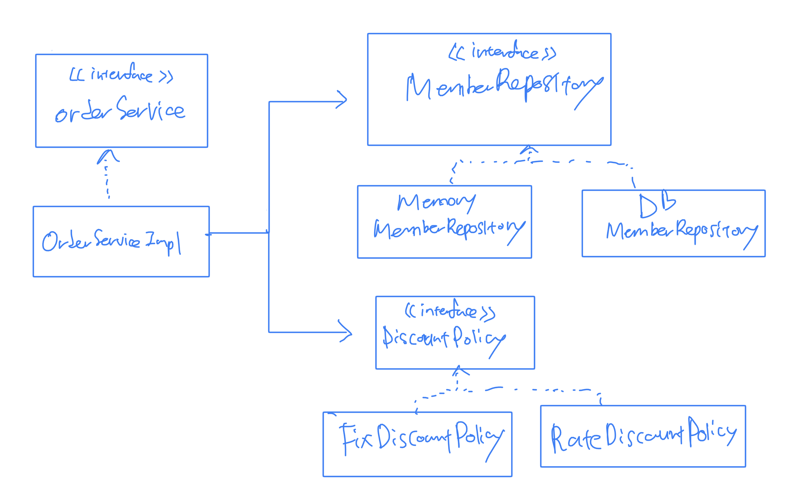
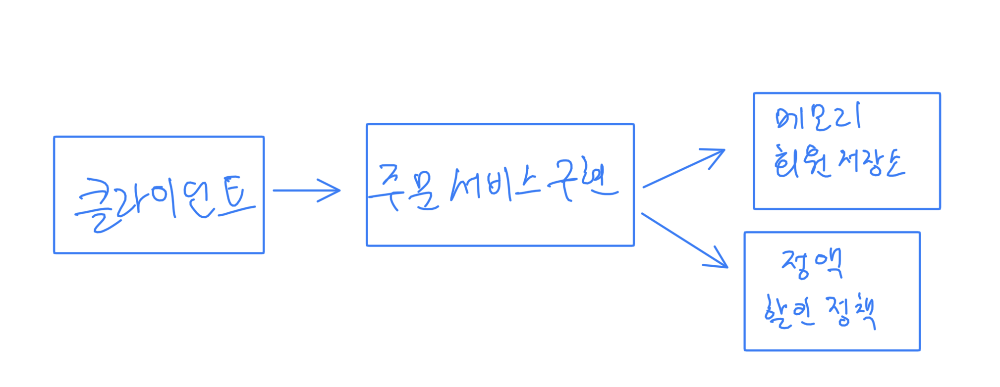
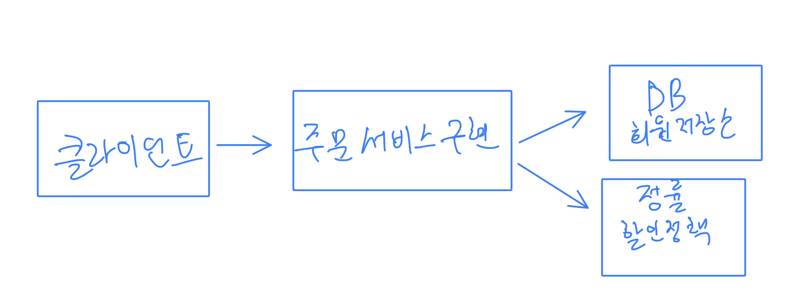

# 주문과 할인 도메인 설계

주문과 할인정책은 다음과 같다
* 회원은 상품 주문 가능
* 회원 등급에 따라 정책 적용
* 정책 중 VIP는 1000원을 할인해주는 고정금액 할인 (추후 변경 가능)
* 할인 정책은 아직 미확정. 최악의 경우 적용 안될 수도 있음.

먼저 주문 도메인의 역할부터 정함

1. 주문 생성 - 클라이언트가 주문 서비스에 생성 요청
2. 회원 조회 - 회원 등급을 위한 회원 조회
3. 할인 적용 - 회원 등급에 따른 할인 여부를 할인 정책에 위임
4. 주문 결과 반환 - 할인 결과 포함된 주문 결과 반환

역할+구현까지 그려진 표는 다음과 같음.

여기서 역할과 구현을 분리했기 때문에 자유롭게 구현 객체 조립이 가능.\
회원 저장소와 할인 정책도 유연하게 변경이 가능해진다.

이를 클래스 다이어그램으로 나타내면 다음과 같음.

객체 그램들은 다음 두가지 방식으로 나올 수 있음. - 실제 App에서 동적으로 객체들의 연관관계가 표현된 그림.

