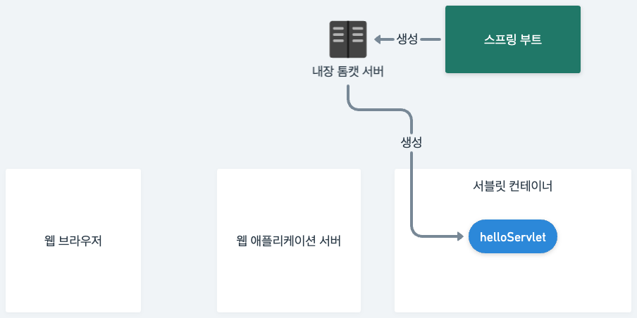
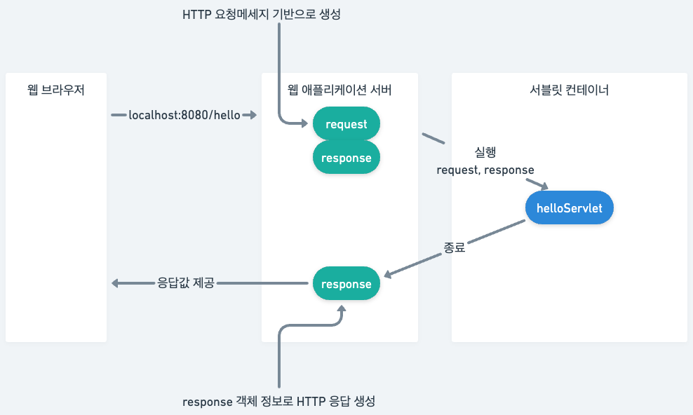

# Hello 서블릿

스프링부트 환경에서 서블릿 설정.

스프링부트는 서블릿을 직접 등록해서 사용하도록 '@ServletComponentScan' 애노테이션 제공. 
```java
@ServletComponentScan //서블릿 자동 등록 
@SpringBootApplication
public class ServletApplication {
    ...
}
```

서블릿은 HttpServlet 을 상속 받음. 상속 후 서블릿 스캔을 위한 @WebServlet 애노테이션 추가.
```java

@WebServlet(name = "helloServlet", urlPatterns = "/hello")
public class HelloServlet extends HttpServlet{
    @Override
    protected void service(HttpServletRequest request, HttpServletResponse response){
        
    }
}

```
'/hello' 로 접근 시 해당 클래스가 실행. 그리고 접근자가 protected인 service 를 오버라이드한다.

먼저 Request, Response 주소값 확인
```java
@Override
protected void service(HttpServletRequest request, HttpServletResponse response){
    System.out.println("HelloServlet.service");
    System.out.println("request = " + request);
    System.out.println("response = " + response);
}
```
웹 브라우저 호출 시(http://localhost:8080/hello) 아래와 같이 주소값이 출력됨.
```text
HelloServlet.service
request = org.apache.catalina.connector.RequestFacade@2e30542f
response = org.apache.catalina.connector.ResponseFacade@3ab6908c
```
쿼리 파라미터를 가져오기 위해선 request.getParameter("{가져올 키}")를 넣어준다.\
쿼리 파라미터가 잘 넘어오는지 확인하기 위해 다음과 같이 호출
* http://localhost:8080/hello?username=kim

```java
@Override
protected void service(HttpServletRequest request, HttpServletResponse response){
        ...
        String username = request.getParameter("username");
        System.out.println("username = " + username);
}
```
정상 동작 시 아래와 같이 출력된다.
```text
username = kim
```

응답 확인은 아래와 같이 추가해준다.
```java
@Override
protected void service(HttpServletRequest request, HttpServletResponse response){
        ...
        response.setContentType("text/plain");
        response.setCharacterEncoding("utf-8");
        response.getWriter().write("hello " + username);
}
```
위와 같이 추가 후 서버를 구동하여 /hello?username=kim 을 호출 하면 브라우저에 "hello kim"이라는 문구가 출력. 응답 헤더도 위에 넣은 값이 그대로 출력됨.

동작 방식은 아래 이미지와 같음.

* 최초 생성


1. 스프링부트에서 내장 톰캣 서버를 생성
2. 톰캣 서버는 내부에 서블릿 컨테이너 기능을 갖고 있음.
3. 서블릿 컨테이너를 통해 서블릿을 모두 생성

* 동작 방식


1. 웹브라우저에서 호출 시 HTTP 요청 기반으로 request 생성
2. request, response 객체를 만들어서 helloServlet 객체 호출
3. helloServlet에서 필요 작업 후 종료하면서 response에 해당 정보를 넣음
4. response 객체정보를 갖고 WAS가 HTTP응답 생성
5. 응답값 리턴