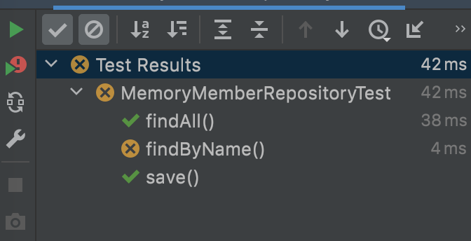

# 테스트 케이스 작성
보통 개발기능 테스트를 위해선
* 메인 메서드를 사용하거나
* 웹앱의 컨트롤러를 통해서 실행

하지만 이런 방법들은 준비하고 실행하는데 시간이 오래 걸리고 반복 실행이 어렵다. 
또한 여러 테스트를 한번에 실행하기 역시 어렵다. 이 단점을 해결하기 위해 자바에서는 JUnit이라는 모듈로
테스트를 진행한다.

test/java 에 repository 패키지를 똑같이 만들어준다. 그리고 아래와 같이 코드를 작성해준다.
설명은 아래 주석부분에 작성했다.
```java
package hello.hellospring.repository;

import hello.hellospring.domain.Member;
//import org.junit.jupiter.api.Assertions;
import org.junit.jupiter.api.Test;

import static org.assertj.core.api.Assertions.*;

class MemoryMemberRepositoryTest {  //관례. 테스트할 클래스 이름 옆에 'Test'를 붙여준다.

    MemoryMemberRepository repository = new MemoryMemberRepository(); //테스트할 클래스 생성.

    @Test
    public void save(){
        Member member = new Member();
        member.setName("spring");

        repository.save(member);

        Member result = repository.findById(member.getId()).get();

        // org.junit.jupiter.api.Assertions 메소드. assertEquals로 같은지 테스트.
        // 만약 다르면 에러 메세지가 나타난다. 
//        Assertions.assertEquals(member, result); 
        
        //org.assertj.core.api.Assertions 메소드. 실무에서 많이 쓰이며 assertThat의 인자값이 isEqualsTo와 같은지 비교.
        // 역시 서로 다르면 에러 메세지가 나온다.
        assertThat(member).isEqualTo(result);
    }
    
}
```

findByName 에 대한 테스트도 진행한다.
```java
@Test
public void findByName(){
    Member member1 = new Member();
    member1.setName("spring1");
    repository.save(member1);

    Member member2 = new Member();
    member2.setName("spring2");
    repository.save(member2);

    Member result = repository.findByName("spring1").get();

    assertThat(result).isEqualTo(member1);
}
```
테스트를 진행할 때 이름을 get 해오는 부분과 아래 테스트 코드 부분의 객체가 서로 같으면 아래와 같은 메세지가 나온다.
```shell
Process finished with exit code 0
```
반면, 서로 다른 객체라면 아래와 같이 메세지가 나오게 된다.(테스트 케이스가 실패했을 경우)
```shell
org.opentest4j.AssertionFailedError: 
expected: hello.hellospring.domain.Member@63a65a25
 but was: hello.hellospring.domain.Member@6b26e945
Expected :hello.hellospring.domain.Member@63a65a25
Actual   :hello.hellospring.domain.Member@6b26e945
<Click to see difference>

...
	at java.base/java.lang.reflect.Constructor.newInstanceWithCaller(Constructor.java:499)
	at hello.hellospring.repository.MemoryMemberRepositoryTest.findByName(MemoryMemberRepositoryTest.java:39)
      ...
	at java.base/java.util.ArrayList.forEach(ArrayList.java:1511)
	  ...
	at java.base/java.util.ArrayList.forEach(ArrayList.java:1511)
      ...


Process finished with exit code 255
```
마지막 findAll 테스트 케이스도 작성해준다.
```java
@Test
public void findAll(){
    Member member1 = new Member();
    member1.setName("spring1");
    repository.save(member1);

    Member member2 = new Member();
    member2.setName("spring2");
    repository.save(member2);

    List<Member> result = repository.findAll();

    assertThat(result.size()).isEqualTo(2);

}
```
테스트 케이스를 모두 작성하고 전체 테스트를 진행하면 아래와 같이 에러가 발생하는 것을 볼 수 있다. 
```shell
org.opentest4j.AssertionFailedError: 
expected: hello.hellospring.domain.Member@3967e60c
 but was: hello.hellospring.domain.Member@20d28811
Expected :hello.hellospring.domain.Member@3967e60c
Actual   :hello.hellospring.domain.Member@20d28811
<Click to see difference>
```
전체 테스트 진행시에는 메소드 실행이 순차적으로 이루어지지 않는다. 
순서보장이 되지 않는 것이다. 위와 같은 테스트 케이스의 경우 아래처럼 findAll 메소드가 먼저 실행되었다.


이렇게 되면 findAll에서 먼저 member1로 만들었던 "spring1" 이 만들어진 상태로 repository 객체에 남아있게 되고,
다음 findByName 실행 시 이미 만들어진 "spring1"과 findByName 메소드 안의 "spring1" 객체가 서로 다르기 때문에
에러가 나게 된다. 위의 메세지를 보면 객체주소가 서로 다른 것을 볼 수 있다.(Member@3967e60c / Member@20d28811)

이와 같은 문제를 방지하기 위해 테스트가 하나 끝나면 데이터를 클리어 해주어야 한다.
클리어 할 수 있는 메소드를 기존 MemoryMemberRepository에 하나 만들어준다.
```java
//hello.hellospring.repository

public void clearStore(){
    store.clear();
}
```
그리고 테스트 코드쪽에도 테스트진행때마다 데이터를 클리어해주는 메소드를 작성해준다.
```java
@AfterEach
public void afterEach(){
    repository.clearStore();
}
```
이 afterEach 메소드는 테스트 하나가 끝날 때 마다 실행되는 콜백메소드이다. 위 코드는 테스트가 끝날 때마다 메모리의 데이터를 비워주도록 했다.
이렇게 만들어 두면 테스트가 실행되고 나서 메모리의 데이터가 비워지므로 각 메소드마다 의존관계 없이 테스트가 가능해진다.
전체 테스트 코드는 다음과 같다.

```java
package hello.hellospring.repository;

import hello.hellospring.domain.Member;
//import org.junit.jupiter.api.Assertions;
import org.junit.jupiter.api.AfterEach;
import org.junit.jupiter.api.Test;

import java.util.List;

import static org.assertj.core.api.Assertions.*;

class MemoryMemberRepositoryTest {

    MemoryMemberRepository repository = new MemoryMemberRepository();

    @AfterEach
    public void afterEach(){
        repository.clearStore();
    }

    @Test
    public void save(){
        Member member = new Member();
        member.setName("spring");

        repository.save(member);

        Member result = repository.findById(member.getId()).get();
//        Assertions.assertEquals(member, result);
        assertThat(member).isEqualTo(result);
    }

    @Test
    public void findByName(){
        Member member1 = new Member();
        member1.setName("spring1");
        repository.save(member1);

        Member member2 = new Member();
        member2.setName("spring2");
        repository.save(member2);

        Member result = repository.findByName("spring1").get();

        assertThat(result).isEqualTo(member1);
    }

    @Test
    public void findAll(){
        Member member1 = new Member();
        member1.setName("spring1");
        repository.save(member1);

        Member member2 = new Member();
        member2.setName("spring2");
        repository.save(member2);

        List<Member> result = repository.findAll();

        assertThat(result.size()).isEqualTo(2);

    }

}
```

현재는 개발을 먼저 진행하고 이 이후에 테스트를 진행했지만, 반대로 테스트케이스 작성을 먼저 하면서 개발을 진행하는 방법을 TDD라고 한다.
개발을 함에 있어서 테스트는 상당히 중요하다.