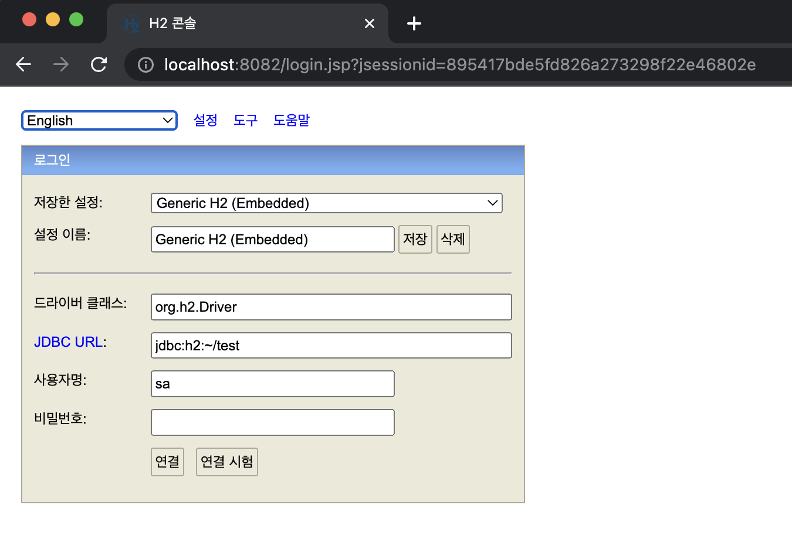
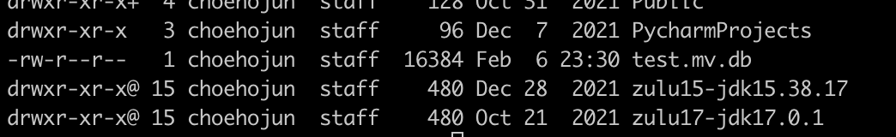
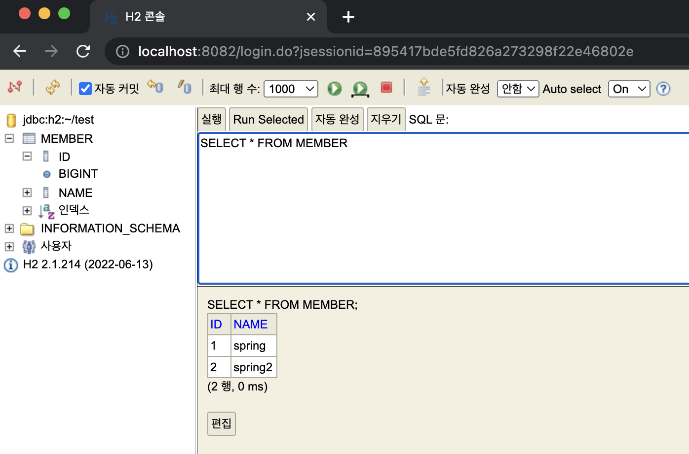

# h2데이터베이스 설치

현재 프로젝트는 메모리에 데이터를 저장하게 되어있는데, 메모리가 아닌 실제 DB에 데이터를 저장하도록
DB를 설치해보자.

예전엔 JDBC를 이용하여 DB에 데이터를 저장하고 조회하는 방식을 많이 사용하였다. SQL을 이용하여 DB에
직접 쿼리를 날리는 방식이었다. 하지만 지금은 JPA라는 방식을 많이 사용하며, JPA를 사용하여 객체 자체를
DB에 저장한다. 여기서는 JDBC와 JPA 모두 사용해보도록 한다.

DB 연동을 위해 h2 데이터베이스를 설치한다.

먼저 h2 Database 홈페이지(https://www.h2database.com/html/main.html)에 접속하여
DB를 다운 받는다. 그 후 압축을 풀고 h2/bin/h2.sh 파일을 실행시켜주면 되는데, 맥의 경우는
권한 문제가 있으므로 먼저 chmod 755 h2.sh 명령어를 입력해준 후 DB를 실행한다.

그러고 잠시 기다리면 아래와 같은 창이 나타나게 된다. 여기서 IP로 접근될 경우 IP를 localhost로
변경해준다.



여기서 별다른 세팅 없이 바로 연결을 누르면 아래와 같은 화면으로 접근하게 된다.


접근하게 되면 home에 다음과 같은 파일이 생성된다.



이후의 접근은 JDBC URL을 수정해주는데 아래와 같이 작성해준다.
>jdbc:h2:tcp://localhost/~/test

위의 URL은 파일로 바로 접근하는 것이 아닌 소켓을 통해 접근하는 것이므로 여러곳에서 접근할 수 있다.

실행이 완료되면 아래와 같이 쿼리를 작성해준다.
```sql
create table member
(
    id bigint generated by default as identity, -- 값이 없을 경우 자동으로 값을 채움
    name varchar(255),
    primary key (id)
);
```
그러면  옆에 MEMBER 테이블이 생성된 것을 확인할 수 있다.


값을 두개 정도 넣어보자

```sql
insert into member(name) values('spring');
insert into member(name) values('spring2');
```

입력 후 DB를 조회해보면 정상적으로 값이 들어간 것을 확인할 수 있다.



