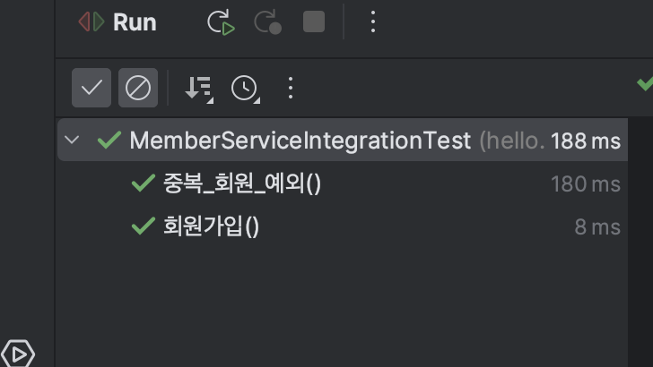

# JPA (Java Persistence API)

JPA는 기존의 반복코드뿐만이 아닌 SQL도 직접 만들어준다. JPA를 이용하면 SQL 중심의 설계에서 데이터
중심의 설계가 가능해지며, 개발 생산성이 크게 높아진다.

먼저 라이브러리를 추가해주자.
```groovy
//build.gralde
implementation 'org.springframework.boot:spring-boot-starter-data-jpa'
```

그리고 설정도 추가해준다.
```properties
...
spring.jpa.show-sql=true
#해당 값을 create로 주면 테이블까지 자동으로 생성해준다.
spring.jpa.hibernate.ddl-auto=none
```
JPA는 인터페이스이며, hibernate, eclipse등이 해당 인터페이스를 구현하는 구현체들이다. 여기선
JPA와 hibernate 조합으로 사용한다. JPA는 ORM(Object Relational Mapping)인데, 간단히 말해
객체와 관계형 데이터베이스의 데이터를 자동으로 매핑해주는 것을 말한다.

다음 Member 객체를 매핑해보자. Member 클래스에 @Entity 를 달아준다.
```java
package hello.hellospring.domain;

import javax.persistence.*;

@Entity //JPA가 관리하는 Entity이다.
public class Member {

    @Id
    //DB가 id를 알아서 생성해주는 것을 Identity 전략이라고 한다.
    @GeneratedValue(strategy = GenerationType.IDENTITY)
    private Long id;

    private String name;

    public Long getId() {
        return id;
    }

    public void setId(Long id) {
        this.id = id;
    }

    public String getName() {
        return name;
    }

    public void setName(String name) {
        this.name = name;
    }
}
```
@Entity를 달아주면 JPA가 해당 클래스를 관리해주며 DB와 매핑할수 있게 해준다. 매핑 후 Key가 있어야 하는데,
여기서는 Id가 Key이므로 id 변수에 @Id 를 달아준다. 아래 @GeneratedValue는 Identity 전략으로
키를 자동 생성한다는 것을 명시해준다.

그 후 JpaMemberRepository 클래스를 만들어준다. 아래는 전체 코드이다.
```java
package hello.hellospring.repository;

import hello.hellospring.domain.Member;

import javax.persistence.EntityManager;
import java.util.List;
import java.util.Optional;

public class JpaMemberRepository implements MemberRepository{

    //JdbcTemplate과 비슷한 역할을 한다. 이 역시 Spring에서 주입해준다.
    //내부적으로 dataSource 등을 모두 갖고 있다.
    private final EntityManager em;

    public JpaMemberRepository(EntityManager em) {
        this.em = em;
    }

    @Override
    public Member save(Member member) {
        em.persist(member);
        return member;
    }

    @Override
    public Optional<Member> findById(Long id) {
        Member member =  em.find(Member.class, id); //PK일 경우 조회
        return Optional.ofNullable(member);
    }

    @Override
    public Optional<Member> findByName(String name) {
        List<Member> result = em.createQuery("select m from Member m where m.name = :name", Member.class)
                .setParameter("name", name)
                .getResultList();

        return result.stream().findAny();
    }

    @Override
    public List<Member> findAll() {
        //JPQL. 객체(정확히는 Entity)를 대상으로 쿼리를 날린다.
        return em.createQuery("select m from Member m", Member.class).getResultList();
    }
}
```
여기선 기존 JdbcTemplate 대신 EntityManager를 선언해주었다. EntityManager는 우리가 위에서 받은
라이브러리를 받으면 SpringBoot가 자동으로 EntityManager를 생성해준다. 우리는 그 생성된 EntityManager를
주입 받아서 사용해주면 된다. 

코드는 기존 JdbcTemplate보다 더 단순해졌다. save 메소드의 경우 persist 메소드만 사용하면 바로
쿼리가 돌면서 DB에 아이디가 저장된다. 조회 역시 객체에서 지정한 ID인 경우 find 메소드로 바로 찾을 수 있다.
name으로 조회하는경우 약간 다른데, JPQL을 작성하여 쿼리를 날려준다. 이때 parameter를 세팅해서 조회를 할 수 있게 해준다.

모든 코드 작성이 완료되면 마지막으로 Service 계층에 @Transaction 어노테이션을 적어준다. JPA는
select를 제외한 insert, update, delete의 경우에 해당 어노테이션이 필요하다. 
```java
@Transactional
public class MemberService {
...
```
@Transaction 까지 달아주었으면, config에서 사용 Repository를 변경해준다.

```java
package hello.hellospring;

import hello.hellospring.repository.JpaMemberRepository;
import hello.hellospring.repository.MemberRepository;
import hello.hellospring.service.MemberService;
import org.springframework.beans.factory.annotation.Autowired;
import org.springframework.context.annotation.Bean;
import org.springframework.context.annotation.Configuration;

import javax.persistence.EntityManager;

@Configuration
public class SpringConfig {

    private EntityManager em;

    @Autowired
    public SpringConfig(EntityManager em) {
        this.em = em;
    }

    @Bean
    public MemberService memberService(){
        return new MemberService(memberRepository());
    }

    @Bean
    public MemberRepository memberRepository(){
//        return new MemoryMemberRepository();
//        return new JdbcMemberRepository(dataSource);
//        return new JdbcTemplateMemberRepository(dataSource);
        return new JpaMemberRepository(em);
    }
}
```
여기서 바뀐점은 DataSource 대신 EntityManager가 선언되었다는 것이다. 그 후 테스트를 진행해본다.
테스트 진행시 SQL이 날아가면서 정상적으로 테스트가 성공하는 것을 볼 수 있다.

```shell
2023-02-11 21:26:51.459  INFO 4510 --- [           main] o.s.t.c.transaction.TransactionContext   : Began transaction (1) for test context [DefaultTestContext@14008db3 testClass = MemberServiceIntegrationTest, testInstance = hello.hellospring.service.MemberServiceIntegrationTest@6e225c34, testMethod = 회원가입@MemberServiceIntegrationTest, testException = [null], mergedContextConfiguration = [WebMergedContextConfiguration@78a773fd testClass = MemberServiceIntegrationTest, locations = '{}', classes = '{class hello.hellospring.HelloSpringApplication}', contextInitializerClasses = '[]', activeProfiles = '{}', propertySourceLocations = '{}', propertySourceProperties = '{org.springframework.boot.test.context.SpringBootTestContextBootstrapper=true}', contextCustomizers = set[org.springframework.boot.test.autoconfigure.actuate.metrics.MetricsExportContextCustomizerFactory$DisableMetricExportContextCustomizer@158a8276, org.springframework.boot.test.autoconfigure.properties.PropertyMappingContextCustomizer@0, org.springframework.boot.test.autoconfigure.web.servlet.WebDriverContextCustomizerFactory$Customizer@5c671d7f, org.springframework.boot.test.context.filter.ExcludeFilterContextCustomizer@c86b9e3, org.springframework.boot.test.json.DuplicateJsonObjectContextCustomizerFactory$DuplicateJsonObjectContextCustomizer@4c309d4d, org.springframework.boot.test.mock.mockito.MockitoContextCustomizer@0, org.springframework.boot.test.web.client.TestRestTemplateContextCustomizer@2898ac89, org.springframework.boot.test.context.SpringBootTestArgs@1, org.springframework.boot.test.context.SpringBootTestWebEnvironment@6eebc39e], resourceBasePath = 'src/main/webapp', contextLoader = 'org.springframework.boot.test.context.SpringBootContextLoader', parent = [null]], attributes = map['org.springframework.test.context.web.ServletTestExecutionListener.activateListener' -> true, 'org.springframework.test.context.web.ServletTestExecutionListener.populatedRequestContextHolder' -> true, 'org.springframework.test.context.web.ServletTestExecutionListener.resetRequestContextHolder' -> true, 'org.springframework.test.context.event.ApplicationEventsTestExecutionListener.recordApplicationEvents' -> false]]; transaction manager [org.springframework.orm.jpa.JpaTransactionManager@fefb66c]; rollback [true]
Hibernate: select member0_.id as id1_0_, member0_.name as name2_0_ from member member0_ where member0_.name=?
Hibernate: insert into member (id, name) values (default, ?)
2023-02-11 21:26:51.465  INFO 4510 --- [           main] o.s.t.c.transaction.TransactionContext   : Rolled back transaction for test: [DefaultTestContext@14008db3 testClass = MemberServiceIntegrationTest, testInstance = hello.hellospring.service.MemberServiceIntegrationTest@6e225c34, testMethod = 회원가입@MemberServiceIntegrationTest, testException = [null], mergedContextConfiguration = [WebMergedContextConfiguration@78a773fd testClass = MemberServiceIntegrationTest, locations = '{}', classes = '{class hello.hellospring.HelloSpringApplication}', contextInitializerClasses = '[]', activeProfiles = '{}', propertySourceLocations = '{}', propertySourceProperties = '{org.springframework.boot.test.context.SpringBootTestContextBootstrapper=true}', contextCustomizers = set[org.springframework.boot.test.autoconfigure.actuate.metrics.MetricsExportContextCustomizerFactory$DisableMetricExportContextCustomizer@158a8276, org.springframework.boot.test.autoconfigure.properties.PropertyMappingContextCustomizer@0, org.springframework.boot.test.autoconfigure.web.servlet.WebDriverContextCustomizerFactory$Customizer@5c671d7f, org.springframework.boot.test.context.filter.ExcludeFilterContextCustomizer@c86b9e3, org.springframework.boot.test.json.DuplicateJsonObjectContextCustomizerFactory$DuplicateJsonObjectContextCustomizer@4c309d4d, org.springframework.boot.test.mock.mockito.MockitoContextCustomizer@0, org.springframework.boot.test.web.client.TestRestTemplateContextCustomizer@2898ac89, org.springframework.boot.test.context.SpringBootTestArgs@1, org.springframework.boot.test.context.SpringBootTestWebEnvironment@6eebc39e], resourceBasePath = 'src/main/webapp', contextLoader = 'org.springframework.boot.test.context.SpringBootContextLoader', parent = [null]], attributes = map['org.springframework.test.context.web.ServletTestExecutionListener.activateListener' -> true, 'org.springframework.test.context.web.ServletTestExecutionListener.populatedRequestContextHolder' -> true, 'org.springframework.test.context.web.ServletTestExecutionListener.resetRequestContextHolder' -> true, 'org.springframework.test.context.event.ApplicationEventsTestExecutionListener.recordApplicationEvents' -> false]]
```

