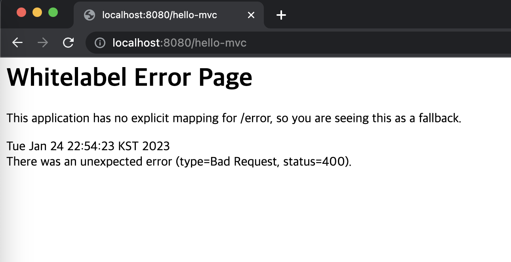

# MVC와 템플릿 엔진

### MVC
MVC 란 Model, View, Controller를 가리키는 말이다. 예전엔 이게 따로 나뉘어있지 않고 View에서 모든걸 다 처리했다.
-> Model 1 방식

하지만 이것에 대한 분리의 필요성을 개발자들이 느꼈음. 그래서 아래와 같이 분리가 됨.
- View: 화면 그리는 것에만 집중
- Controller: 로직이나 내부적인 처리에 집중.
- Model: 화면에 필요한 데이터들을 담아서 전달.

다음과 같은 Controller와 html을 만들어줌
```java
    @GetMapping("hello-mvc")
    public String helloMvc(@RequestParam("name") String name, Model model){
        model.addAttribute("name", name);
        return "hello-template";
    }
```
```html
<html xmlns:th="http://www.thymeleaf.org">
<body>
<p th:text="'hello. ' + ${name}">hello! empty</p>
</body>
</html>
```
html의 hello! empty는 디폴트값이라고 생각하면 됨.

그리고 나서 localhost:8080/hello-mvc를 호출하면 아래와 같은 화면이 나오게 됨.


로그를 확인해보면 아래와 같이 나타난다
```shell
2023-01-24 22:54:23.132  WARN 25478 --- [nio-8080-exec-3] .w.s.m.s.DefaultHandlerExceptionResolver : Resolved [org.springframework.web.bind.MissingServletRequestParameterException: Required request parameter 'name' for method parameter type String is not present]
```
원인은 name 파라미터가 호출시 넘어오지 않았기 때문에 에러가 발생했다.
name이 굳이 필요하진 않으므로 파라미터 옵션값을 더해준다 (파라미터 확인법 cmd+p)
```java
    @GetMapping("hello-mvc")
    public String helloMvc(@RequestParam(name = "name", required = false) String name, Model model){
        model.addAttribute("name", name);
        return "hello-template";
    }
```
수정 후 localhost:8080/hello-mvc?name=spring! 이라고 호출하면 아래와 같이 나타난다.


동작 원리는 3번째 강의(3. View 환경설정)와 동일하다. 차이점이라고 하면 name 파라미터를 받는 다는것이고,
name 파라미터로 받아오는 값을 model에 담아 hello-template.html로 넘겨주면 해당 html에서 화면을 그려주는 것이다.

