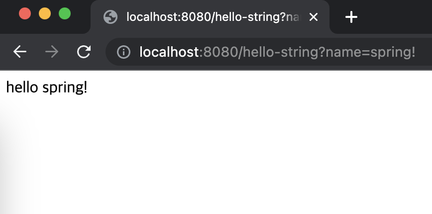

# API

데이터 제공 방법은 API방식과 템플릿 랜더링을 이용한 html 제공 방식이 있다. (정적 제공방식도 있지만 논외로 한다.)

코드를 하나 작성한다.
```java
    @GetMapping("hello-string")
    @ResponseBody
    public String helloMvc(@RequestParam("name") String name){
        return "hello "+name;
    }
```
@ResponseBody는 Response 응답부에 해당 메소드의 리턴값을 그대로 제공해주겠다는 의미임. 차이점은 View가 없이 위의 return String이 
그대로 리턴된다. 위의 컨트롤러를 호출하면 다음과 같이 나온다.


이전 호출과 다른점이라면 이전엔 view 템플릿을 이용해 html소스 안에 'hello spring!'이라는 단어가 보였지만, 지금 호출한 리턴값은 html 소스가 없이
String 그 자체만 응답값으로 주고 있다.

API는 보통 데이터 자체를 리턴하기 위해 만든다. 다음과 같은 코드를 작성한다.
```java
    @GetMapping("hello-api")
    @ResponseBody
    public Hello helloApi(@RequestParam("name") String name){
        Hello hello = new Hello();
        hello.setName(name);
        return hello;
    }

    static class Hello{
        private String name;

        //Java Bean 규약 방식.
        //Property 접근 방식.
        public String getName() {
            return name;
        }
        
        //Java Bean 규약 방식.
        //Property 접근 방식.
        public void setName(String name) {
            this.name = name;
        }
    }
```
위와 같은 방식을 API 방식이라고 이야기 한다. 해당 컨트롤러를 호출하면 다음과 같이 호출된다.


응답값은 JSON으로 제공되며, Key-Value 한 쌍의 데이터로 제공해준다.

응답방식은 다음과 같다.
1. localhost:8080/hello-api?name=spring! 으로 호출이 들어오면 해당 컨트롤러를 찾음.
2. 컨트롤러에 @ResponseBody값이 있으면 Spring은 http응답에 데이터를 넘기는 것으로 판단하고 동작함.
3. 리턴이 객체이면 기본으로 JSON 방식으로 만들어서 return 을 하게 됨.
   1. 객체로 리턴이면 먼저 HttpMessageConverter가 동작함.
   2. 만약 데이터가 문자(1번 case)일 경우 문자 그대로를 리턴 (StringHttpMessageConvertor)
   3. 하지만 데이터가 객체(2번 case)이면 JSON 형식으로 데이터를 리턴. (MappingJackson2HttpMessageConvertor)

> 클라이언트의 Accept 헤더와 컨트롤러 반환 타입 정보 두개를 조합하여 HttpMessageConverter가 동작한다.

결론적으로 데이터 리턴방식에는 총 3가지가 존재한다.
1. 정적 컨텐츠
2. 템플릿엔진과 MVC 방식
3. API 방식