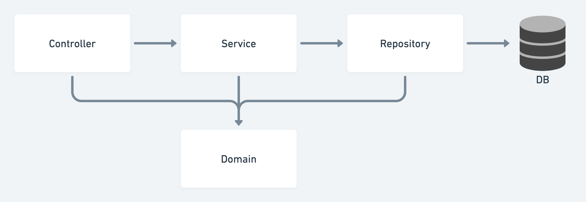

# 비즈니스 요구사항 정리

비즈니스에 대한 요구사항을 정리한다. 여기서는 간단한 회원가입에 대한 비즈니스 요구사항을 정리한다.

요구사항은 다음과 같다.
* 데이터: 회원ID, 이름
* 기능: 회원 등록, 조회
* 아직 데이터 저장소는 선정되지 않음.

위 그림은 일반적인 웹 애플리케이션의 계층 구조를 나타낸다.
* 컨트롤러: 웹 MVC의 컨트롤러 역할
* 서비스: 핵심 비즈니스 로직이 들어감 (중복회원가입 방지 등...)
* 리포지토리: 서비스와 DB를 연결해주는 역할로, 도메인 객체를 DB에 저장하고 관리함.
* 도메인: 데이터베이스에 주로 저장하고 관리되는 비즈니스 도메인 객체

클래스 의존관계는 다음과 같다.

* 회원 비즈니스 로직은 MemberService에서 처리
* DB와 연동하는 부분인 Repository는 인터페이스로 설계함.
  * 아직 데이터 저장소가 선정되지 않아서 초기 개발에는 구현체로 가벼운 메모리 기반 데이터 저장소를 사용.
  * 추후 DB가 지정되면 메모리 구현체 대신 DB 연동 구현체로 변경