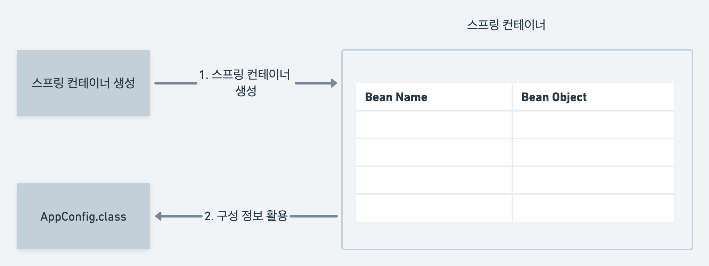

# 스프링 컨테이너 생성

스프링 컨테이너가 생성되는 과정은 다음과 같음

```java
ApplicationContext applicationContext = 
        new AnnotationConfigApplicationContext(AppConfig.class);
```

* ApplicationContext는 스프링 컨테이너다.
* 이전 강의해서 했던 방식은 애노테이션 기반의 자바 설정 클래스로 스프링 컨테이너를 만든 것이다.
* 자바 설정 클래스를 기반으로 스프링 컨테이너를 만든 것이며,
  * new AnnotationConfigApplicationContext(AppConfig.class) 를 통해 컨테이너를 만듦
  * 위 클래스는 ApplicationContext 의 구현체임.

> 정확하게는 스프링 컨테이너를 부를 때 BeanFactory, ApplicationContext로 구분해서 이야기하지만, 요즘은 BeanFactory 를 쓰는 일이 거의 없어서
> 일반적으로 ApplicationContext를 스프링 컨테이너라고 함.

컨테이너 생성 과정은 다음과 같음.




* new AnnotationConfigApplicationContext(AppConfig.class) 가 실행될 때 위와 같이 스프링 컨테이너 생성
* 이때 AppConfig.class 를 구성정보로 지정하여 생성됨.


* 파라미터로 넘어온 AppConfig 클래스에서 @Bean 어노테이션이 달린 메소드들을 등록
* 이때 이름은 메소드 이름
* 빈 이름도 직접 부여 가능 (@Bean(name = "memberService123"))
* **빈 이름은 항상 중복되면 안된다.** 


* 빈 등록이 완료되면 의존성 연결 준비를 함. 위와 같이 등록된 빈들이 존재.


* 등록 된 빈들에 대해 다음과 같이 의존관계가 설정 된다. 
  * 여기서는 memberService 빈은 memberRepository 과 의존관계가 설정
  * orderService 는 memberRepository 와 discountPolicy 두 빈과 의존관계 설정

스프링은 빈을 생성하고 의존관계를 주입하는 단계가 나누어져 있음. 자바로 스프링 빈을 등록할 떄는 생성자 호출과 동시에 의존관계 주입도 한번에 처리 됨.