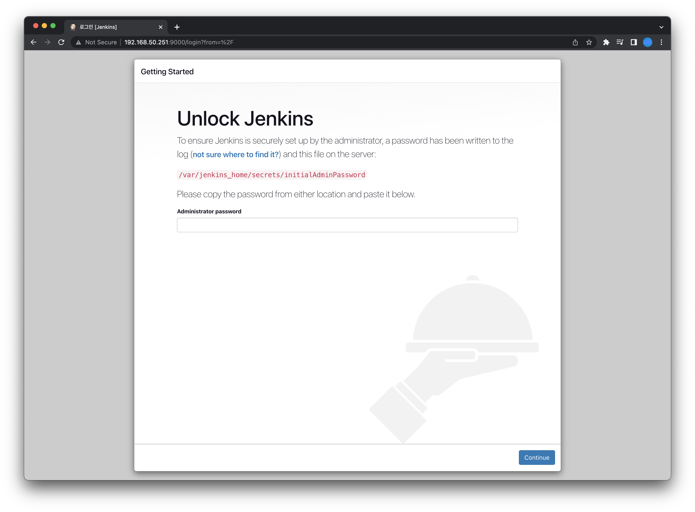
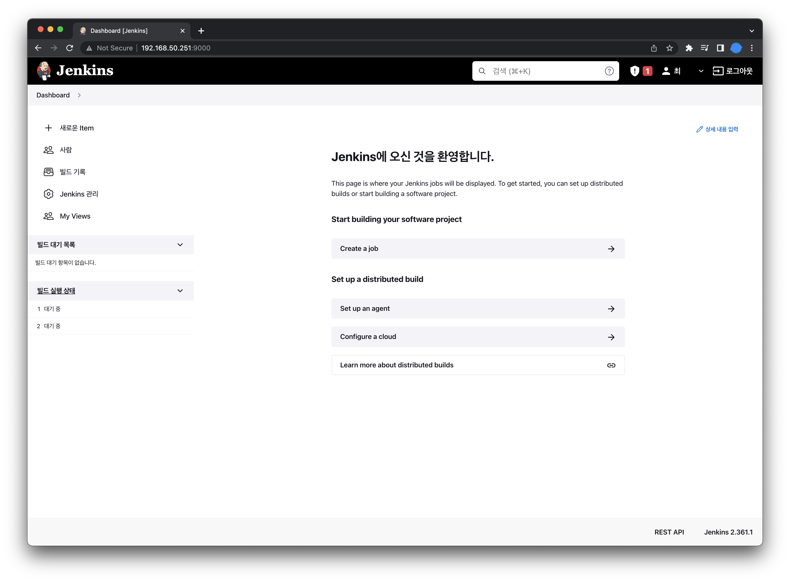

# Jenkins 설치

프로젝트 배포를 위한 Jenkins를 Docker를 이용해 설치 해보도록 하겠다. 최종 목표는 깃허브에 올리는 프로젝트를 빌드하여 서버에 배포하는 것인데, 여기서는
깃허브와 연동하여 최종 배포하는 것 까지 해보려 한다.

일단 Jenkins 를 설치하기 위한 사양은 아래와 같다.

최소사양\
램: 256 MB\
저장 공간: 1 GB

권장 사양\
램: 4 GB 이상\
저장 공간: 50 GB 이상

먼저 Jenkins 이미지를 받아준다. 나는 lts에 jdk11 버전으로 받았다.
```shell
[root@localhost ~]# docker pull jenkins/jenkins:lts-jdk11
lts-jdk11: Pulling from jenkins/jenkins
1671565cc8df: Pull complete
1e010a8344e7: Pull complete
f7406b2e1315: Pull complete
a7516ebe83d2: Pull complete
a51dca64e82b: Pull complete
77ef07b6a141: Pull complete
2ac030a719df: Pull complete
263bf74244c0: Pull complete
620f54e03b44: Pull complete
59e43d37c904: Pull complete
c9dbe2415122: Pull complete
2c049b4765e9: Pull complete
c2b2538c867b: Pull complete
57c5d5e596fd: Pull complete
Digest: sha256:5508cb1317aa0ede06cb34767fb1ab3860d1307109ade577d5df871f62170214
Status: Downloaded newer image for jenkins/jenkins:lts-jdk11
docker.io/jenkins/jenkins:lts-jdk11
```

그다음 아래와 같이 젠킨스를 실행해준다.
```shell
[root@localhost /]# docker run -d -p 9000:8080 -v /data/jenkins/:/var/jenkins_home --name jenkins_git -u root jenkins/jenkins:lts-jdk11
212bce83ec57e5b130d4ae8bd4facd1ca546ae88438898cb573c3af41b27d351
[root@localhost /]#
```

실행 후 지정한 포트로 접근하면 아래와 같이 초기 비밀번호를 입력하라는 안내가 나온다.
위치는 아래 친절하게 작성해주었으니, 컨테이너 내부로 들어가 해당 위치의 파일을 확인한다.


파일을 확인하면 아래와 같이 비밀번호를 보여준다 (뒤의 *은 마스킹처리한 단어이다.)
```shell
[root@localhost /]# docker exec -it 212bce83ec57 /bin/bash
root@212bce83ec57:/# ls
bin   dev  home  lib64	mnt  proc  run	 srv  tmp  var
boot  etc  lib	 media	opt  root  sbin  sys  usr
root@212bce83ec57:/# cat /var/jenkins_home/secrets/initialAdminPassword
18cbda63b8ca42cd8***************
root@212bce83ec57:/var/jenkins_home/secrets#
```

입력 후 continue를 누르면 아래처럼 어떻게 설치할 것인지 선택하는 화면이 나온다. 커스텀해서 사용할 것이 아니라면 젠킨스가 추천하는 기본적인 설치방법으로 설치해준다.
왼쪽에 Install suggested plugins를 선택해준다.


선택하면 아래와 같이 젠킨스가 알아서 설치를 해준다. 설치가 다 진행될 때 까지 기다려준다.


설치가 완료되었으면 admin계정의 기본 정보입력과 젠킨스 접근 URL을 설정하는 창이 나오는데... 깜빡하고 캡쳐를 못했다...
크게 중요한 부분은 없으니 정보 입력 후 다음버튼을 열심히 눌러주자.

다 완료되면 아래처럼 메인화면이 나오게 된다. 여기까지 진행했으면 젠킨스 설치가 완료된 것이다.

