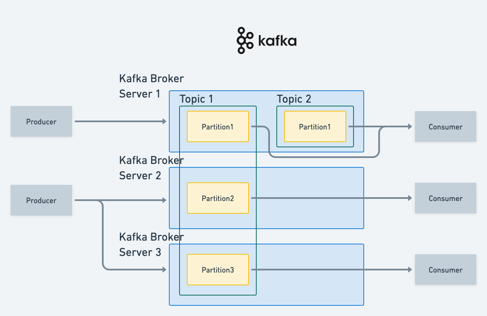
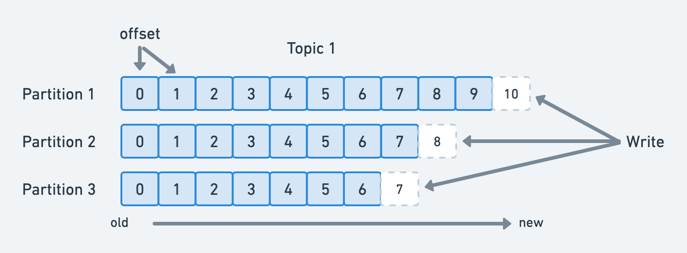

# Kafka에 대한 정리

현재 실무에서 실제로 사용하게 될 Kafka(이하 카프카)에 대해 어떤 역할을 하는지는 대략적으로 알고 있지만, 현재 너무 수박 겉핥기 식으로 알고 있다보니 업무에서 사용 시
제대로된 개념 없이 사용하고 있다는 느낌을 종종 받고있다. 그래서 개념 정리 겸 실무 사용에서도 버벅이지 않고 잘 사용하기 위해 카프카에 대한 전반적인 내용을
정리해보려 한다.

### Kafka(카프카)란?

아파치 카프카 공식 사이트에서는 카프카를 다음과 같이 소개하고 있다.
> Apache Kafka®는 이벤트 스트리밍 플랫폼입니다.

카프카는 대용량, 대규모의 데이터를 빠르게 분산 처리할 수 있는 메세지 스트리밍 플랫폼이다. 데이터 파이프라인 구성 시 사용되는 오픈소스이며, APP간 메세지 교환을
관리해주는 역할을 하는 프로그램이라 생각하면 이해가 조금 쉬워진다. 기존 DB 하나에 붙어 의존하던 시스템이 점점 MSA 형태로 변함에 따라 모듈간의 메세지 전달을
원할하게 하기 위해 많이 사용하고 있다.

### 카프카 구조

위 그림은 카프카 구조에 대해 대략적으로 그린 구조도이다. 구성요소들은 다음과 같다.
* Producer: 메세지를 보내는 쪽이다. 메세지는 보내는 행위를 Publish(Pub) 이라고 한다.
* Consumer: 메세지는 받는 쪽이다. 메세지를 받는 행위를 Subscribe(Sub) 이라고 한다.
* Topic: 이벤트(메세지)를 저장하는 일종의 저장소. 단순화된 토픽은 컴퓨터의 폴더와 유사하며, 이벤트(메세지)는 그 폴더의 파일이라고 볼 수 있다.
* Kafka Broker: 실질적인 메세지를 처리해주는 카프카 서버이다. 단일 및 클러스터 구성이 가능하며 토픽별로 별도의 파티션을 가질 수 있다.
* Partition: 토픽을 통해 들어오는 데이터를 분산저장할 수 있는 저장소. 쉽게 말해 바구니라고 생각할 수 있다.

위의 프로듀서와 컨슈머에서 작성한 메세지를 보내는/받는 행위를 pub/sub 모델이라고 하는데, 위키백과에서는 다음과 같이 정의하고 있다.
> 발행-구독(pub/sub) 모델은 비동기 메시징 패러다임이다. 발행-구독 모델에서 발신자의 메시지는 특별한 수신자가 정해져 있지 않다. 
> 대신 발행된 메시지는 정해진 범주에 따라, 각 범주에 대한 구독을 신청한 수신자에게 전달된다. 
> 수신자는 발행자에 대한 지식이 없어도 원하는 메시지만을 수신할 수 있다. 이러한 발행자와 구독자의 디커플링은 높은 확장성을 허용한다.

### 파티션

카프카의 파티션은 토픽을 통해 들어오는 데이터를 저장하는 저장소이다. 한 개의 토픽은 한 개 이상의 파티션으로 구성되어 있으며, 파티션은 메시지 추가만 가능한
append-only 방식의 파일이다. 실제 데이터들이 파일로 남기 때문에 서비스 중 장애가 발생하더라도 메세지들이 날아가지 않고 파일형식으로 남아 있어 복구에 용이하다.