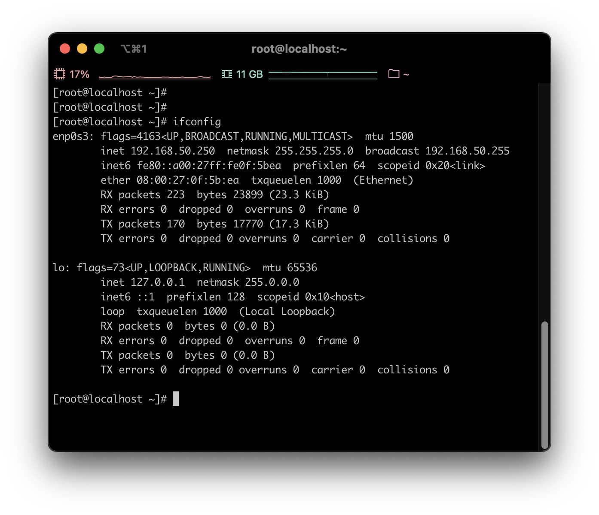
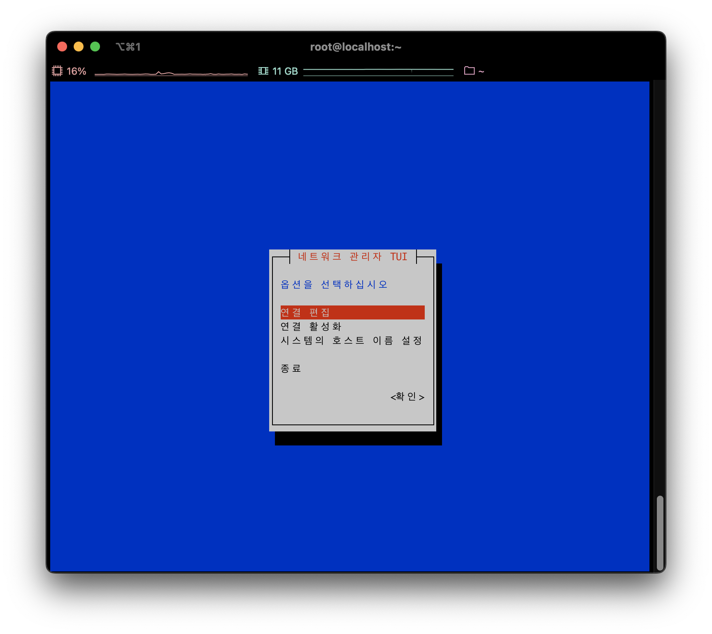
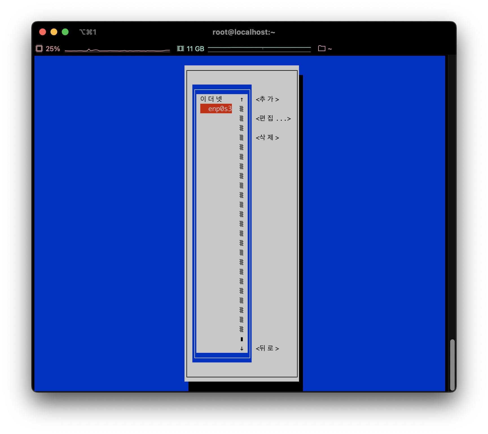
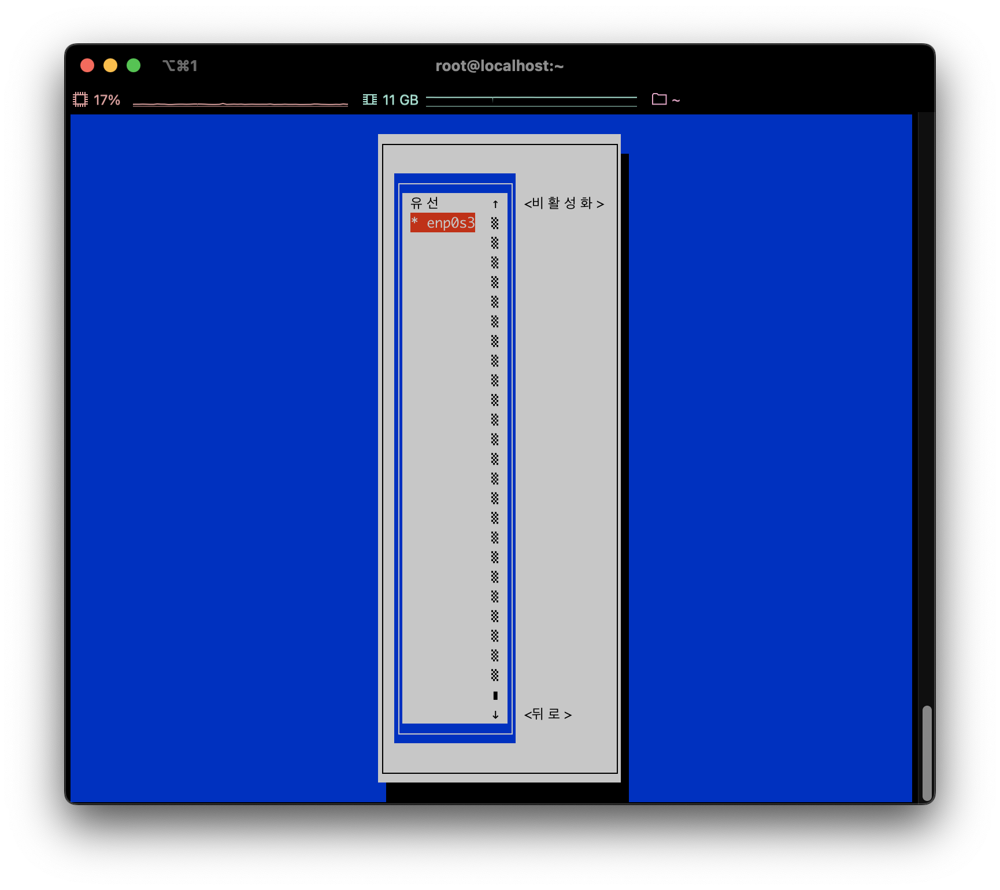
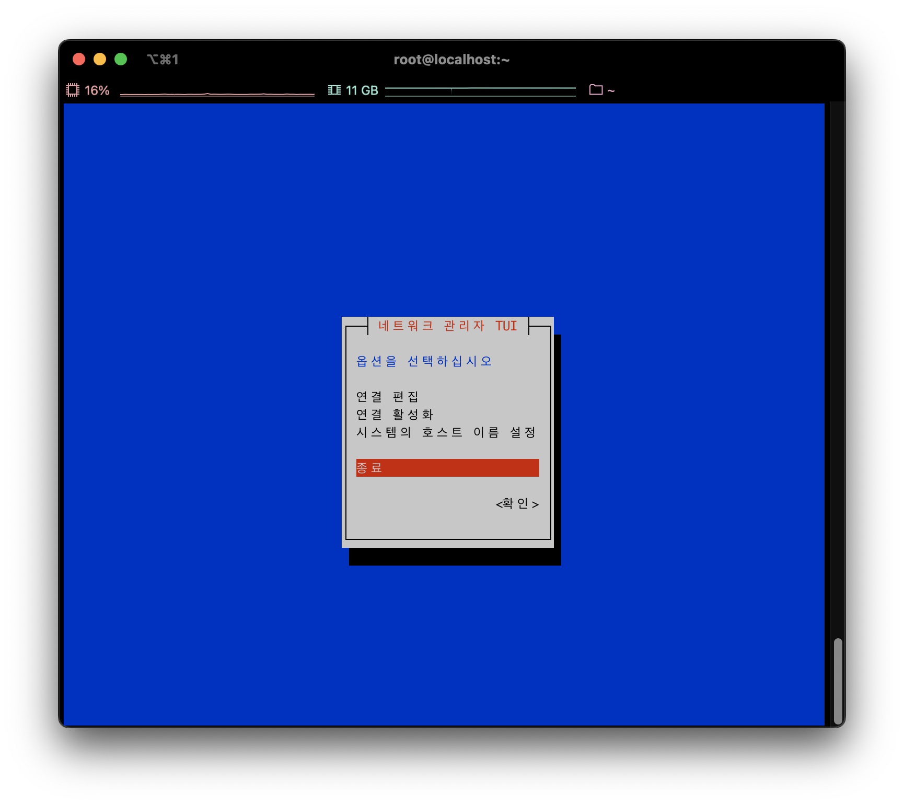
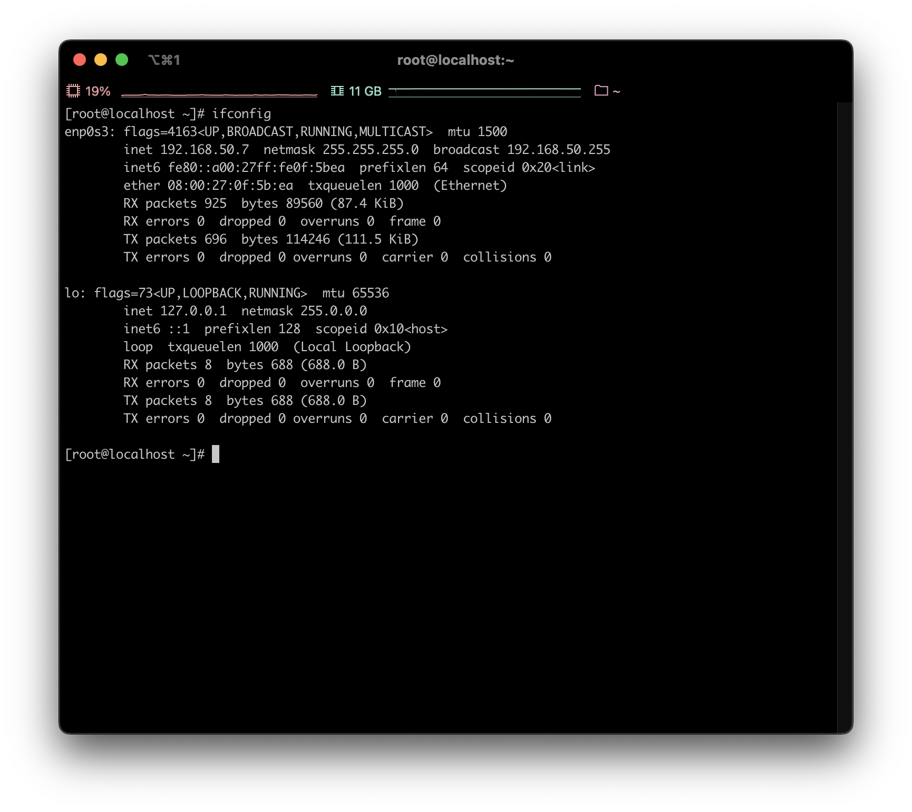

# Rocky Linux 에서 고정 아이피 세팅하기

이번 개인 프로젝트를 진행하면서 centos를 대체할 만한 리눅스를 찾다가 여러 기업에서 현재 사용하고 있다는 Rocky Linux를 설치 하였다.
설치는 크게 어렵진 않았는데 Rocky Linux도 RHEL 기반인데다 centos의 정신적 후속작이기 때문에 과정 자체는 동일하였다. 
그래서 고정아이피도 수월하게 세팅하겠구나~ 했는데 웬걸... 내 PC만 그런건지 모르겠는데 network-script 디렉토리 안에 설정 내용이 하나도 
없는 것이다... 그래서 여기저기 검색 후 겨우 고정아이피를 세팅할 수 있었는데, 그 과정을 적어볼까 한다.

IP 세팅 전, 이야기할 것은 나의 경우 설정 파일이 없어서 아래와 같이 세팅을 진행했다. 만약 network-script 디렉토리 안에
설정 파일이 있다면 안의 설정파일내용을 변경하여 고정아이피 세팅이 가능하다.

IP를 확인해준다. 현재 나는 IP 끝이 250으로 세팅되어 있는 것을 볼 수 있다.


이 상태에서 네트워크 세팅을 변경하기 위해 아래 명령어를 입력해준다.
```shell
[root@localhost ~]# nmtui
```

그럼 다음과 같은 UI창이 나오게 된다.


이미지는 한글로 나오지만 보통은 영어로 표시된다. 여기서 맨 위에 연결 편집(Edit a connection)을 선택하고 엔터를 누르면 아래와 같이 나온다.


각자 자신의 컴퓨터에 알맞는 인터페이스를 선택한다. (여기서는 enp0s3)


여기서 IPv4 를 수동(Manual)로 변경한 후, 옆에 보이기(Show)를 눌러주면 위 이미지와 같이 확장된 화면이 나오게 된다.
주소(Address)로 이동하여 추가(add)를 누른 후 변경할 IP를 입력해준다. 그 후 게이트웨이와 DNS 서버를 입력해준 후, 확인을 선택한다.


그 후 돌아가서 연결 활성화(Activate a connection)를 선택하면 위 창이 나오게 되는데, 기본적으로 활성화된 상태로 나오게 된다.
(옆에 *표시가 있으면 활성화 상태) 이 상태에서 수정한 인터페이스를 한 번 비활성화 했다 다시 활성화해준다. (엔터 두번 누르면 된다.)


마지막으로 종료하고 UI 창을 나온다.


IP가 정상적으로 변경된 것을 확인할 수 있다.