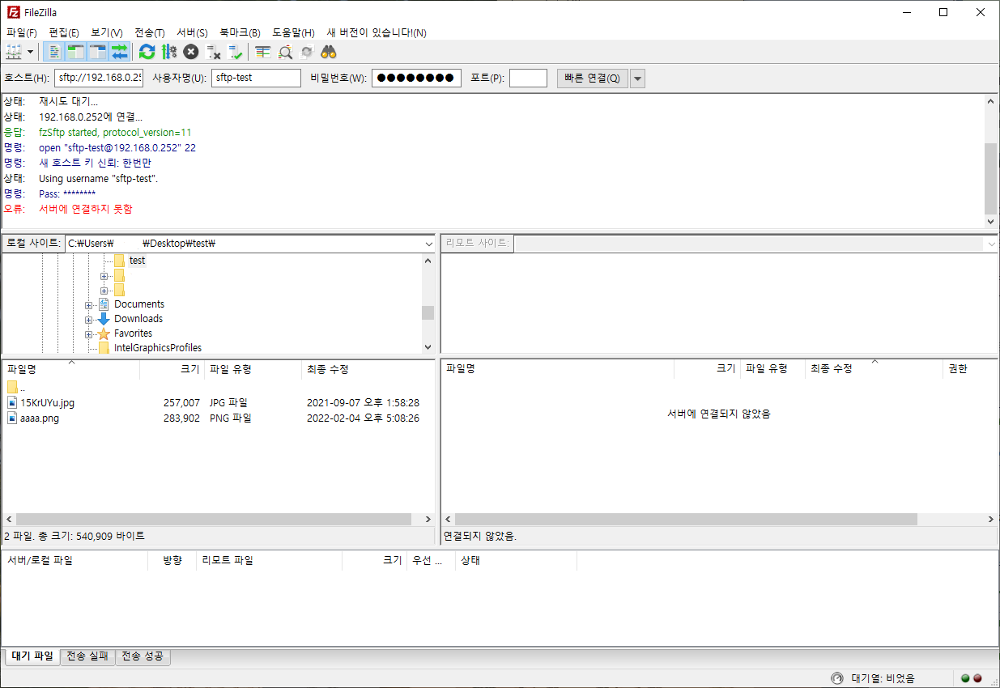

# SFTP 접속을 위한 계정 생성하기.

### 그룹 생성
```shell
[root@localhost ~]# groupadd sfpt-only
[root@localhost ~]# 
```

### 계정 생성
> useradd -s /sbin/nologin -G sftp-only 계정이름

```shell
[root@localhost ~]# useradd -s /sbin/nologin -G sftp-only sftp-test
[root@localhost ~]#
```

### 패스워드 설정

```shell
[root@localhost ~]# echo 'test1234' | passwd --stdin sftp-test
Changing password for user sftp-test.
passwd: all authentication tokens updated successfully.
[root@localhost ~]# ssh sftp-test@localhost
sftp-test@localhost's password: 
```

```shell
This account is currently not available.
Connection to localhost closed.
[root@localhost ~]# 
```
패스워드는 맞지만 쉘 권한이 없어서 세션이 닫힌 상태.

### chroot 적용하기
chroot는 루트 디렉토리를 변경하는 리눅스 명령어. 해당 명령이 실행된 위치를 루트(/)로 인식하게 해준다.\
sftp 계정 생성 시 보안을 위해 정해진 위치를 루트로 사용하게 바꿔준다. 이렇게 되면 정해진 디렉토리의 상위 디렉토리로\
접근하지 못하게 된다.

```shell
[root@localhost ssh]# vi /etc/ssh/sshd_config 
```

```shell
...
# override default of no subsystems
Subsystem       sftp    /usr/libexec/openssh/sftp-server

# Example of overriding settings on a per-user basis
#Match User anoncvs
#       X11Forwarding no
#       AllowTcpForwarding no
#       PermitTTY no
#       ForceCommand cvs server
```
마지막 부분을 보면 기본 세팅으로 다음과 같이 sftp-server로 되어있음.\
해당 부분은 주석 처리하고 아래와 같이 변경해준다.

```shell
#Subsystem       sftp    /usr/libexec/openssh/sftp-server
Subsystem       sftp    internal-sftp
Match Group sftp-only
        ChrootDirectory /sftp_home/
        ForceCommand internal-sftp -d %u
```

sftp-server를 internal-sftp로 변경하는 이유는 다음과 같다.
* internal-sftp는 sftp-server와 달리 sshd 내부에 포함된 모듈을 사용하여 별도의 실행파일이 없음.
* sshd_config 설정만으로 chroot 설정이 가능하다.

\
다만 chroot 사용시 디렉토리의 소유자와 권한에 대해 주의해주어야 한다.
1. 소유자는 root 여야 함.
2. root 이외의 사용자가 접속 '/' 경로에 쓰기 권한이 있어서는 안된다.(755. 그룹, 기타 사용자는 읽기 실행 권한만 있어야함.)
   2. root 이외 사용자에게 쓰기 권한이 있으면 sftp 접속이 안된다.
3. '/' 경로에 쓰기 권한이 없으니 접속하는 사용자가 파일 업로드가 불가능하다. 
   1. 접속자 소유의 uploads 디렉토리를 각 '/' 경로 밑에 만들어주면 해결.


*경로 설정이 안되어 있으면 sftp 접속이 되지 않는다.*

```shell
[root@localhost /]# ll
total 16
...
drwxr-xr-x.   2 root root    6 May 19 16:40 sftp_home
drwxr-xr-x.   2 root root    6 Apr 11  2018 srv
...
```
```shell
[root@localhost sftp_home]# mkdir -p /sftp_home/sftp-test/uploads
[root@localhost sftp_home]# ll
total 0
drwxr-xr-x. 3 root root 21 May 19 16:42 sftp-test
[root@localhost sftp_home]# cd sftp-test/
[root@localhost sftp-test]# ll
total 0
drwxr-xr-x. 2 root root 6 May 19 16:42 uploads
```

```shell
[root@localhost sftp-test]# chown sftp-test:sftp-only /sftp_home/sftp-test/uploads
[root@localhost sftp-test]# ll
total 0
drwxr-xr-x. 2 sftp-test sftp-only 6 May 19 16:42 uploads
[root@localhost sftp-test]#
```

```shell
[root@localhost sftp-test]# service sshd restart
Redirecting to /bin/systemctl restart sshd.service
```


* 참고: https://zetawiki.com/wiki/SFTP%EB%A7%8C_%EB%90%98%EB%8A%94_%EA%B3%84%EC%A0%95_%EC%83%9D%EC%84%B1