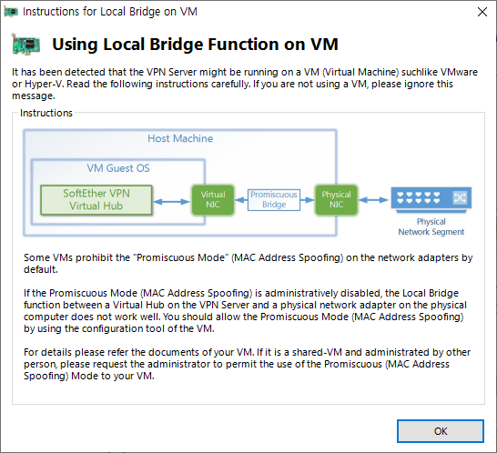
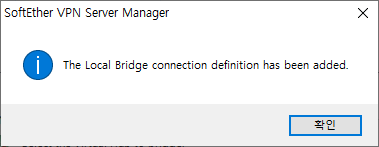
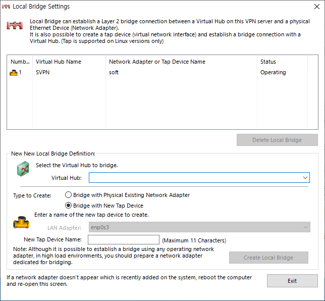

# Softether VPN 브릿지 모드 세팅

#### 참고 URL
* <https://blog.kerus.net/690/setup-softether-vpn-local-bridge/>
* <https://damoa-nawa.tistory.com/89>

이 항목을 읽기 전에 서버 세팅을 먼저 읽고 오는 것을 추천함.

먼저 브릿지 생성을 해주자. 관리자 툴에서 'local bridge setting'을 눌러준다.\


들어가면 브릿지 설정을 위한 화면이 나오게 되는데 'Bridge with New Tap Device'를 클릭한 후, 브릿지 이름을 작성해준다.\
(아래 soft가 작성되어있는 부분. 참고로 생성되는 브릿지 이름 앞에는 'tap_'이라는 이름이 함께 붙는다. 여기서는 tap_soft로 인터페이스가 생성됨.)\
그 후, 'Create Local Bridge'를 눌러준다.\


가상머신으로 서버를 실행시키는 사용자들의 경우 아래 안내문이 나오게 된다. 요지는 네트워크의 Promiscuous Mode(무작위 모드)가 거부상태이면 브릿지가 정상적으로
동작하지 않는다는 내용이다. 해결법은 Virtual Box를 사용하는 사용자라면 가상머신의 설정>네트워크>고급 에서 무작위 모드를 '모두 허용'으로 바꿔주면 된다.\


OK를 눌러주면 브릿지 생성이 완료되었다는 알람이 나온다.\


그리고 아래와 같이 브릿지가 추가되어 동작하고 있는 것을 확인할 수 있다.\


그 후, tap_soft 라는 인터페이스가 추가되었는지 확인한다.

```shell
[root@localhost ~]# ifconfig
enp0s3: flags=4419<UP,BROADCAST,RUNNING,PROMISC,MULTICAST>  mtu 1500
        inet 192.168.50.250  netmask 255.255.255.0  broadcast 192.168.50.255
        inet6 fe80::a00:27ff:fe0f:5bea  prefixlen 64  scopeid 0x20<link>
        ether 08:00:27:0f:5b:ea  txqueuelen 1000  (Ethernet)
        RX packets 1753265  bytes 354563460 (338.1 MiB)
        RX errors 0  dropped 90  overruns 0  frame 0
        TX packets 1730131  bytes 303076445 (289.0 MiB)
        TX errors 0  dropped 0 overruns 0  carrier 0  collisions 0

lo: flags=73<UP,LOOPBACK,RUNNING>  mtu 65536
        inet 127.0.0.1  netmask 255.0.0.0
        inet6 ::1  prefixlen 128  scopeid 0x10<host>
        loop  txqueuelen 1000  (Local Loopback)
        RX packets 68  bytes 31027 (30.2 KiB)
        RX errors 0  dropped 0  overruns 0  frame 0
        TX packets 68  bytes 31027 (30.2 KiB)
        TX errors 0  dropped 0 overruns 0  carrier 0  collisions 0

tap_soft: flags=4163<UP,BROADCAST,RUNNING,MULTICAST>  mtu 1500
        inet6 fe80::5c1e:f4ff:fe99:80cb  prefixlen 64  scopeid 0x20<link>
        ether 5e:1e:f4:99:80:cb  txqueuelen 1000  (Ethernet)
        RX packets 26  bytes 1224 (1.1 KiB)
        RX errors 0  dropped 0  overruns 0  frame 0
        TX packets 14  bytes 1148 (1.1 KiB)
        TX errors 0  dropped 0 overruns 0  carrier 0  collisions 0
```

추가가 확인되었으면 IP 할당을 위한 준비를 해준다. 세팅을 하게 되면 할당된 IP 대역으로 접속자에게 VPN IP를 제공해준다.

먼저 DHCP 서버 역할을 해주기 위한 dnsmasq를 설치해준다. 
자세한 설명은 [여기](https://wiki.gentoo.org/wiki/Dnsmasq/ko) 로...
```shell
[root@localhost ~]# dnf install dnsmasq
[root@localhost ~]# systemctl enable dnsmasq --now
```

설정 파일을 vi 로 열어준 후 아래 내용을 추가해준다. VPN 접속 사용자는 50~60 사이의 IP를 할당받게 된다.
```shell
[root@localhost ~]# vi /etc/dnsmasq.conf

# 맨 아래에 다음 내용 추가
interface=tap_soft
dhcp-range=tap_soft,192.168.7.50,192.168.7.60,12h
dhcp-option=tap_soft,option:netmask,255.255.255.0
dhcp-option=tap_soft,option:router,192.168.7.1
dhcp-option=tap_soft,option:dns-server,8.8.8.8
port=0
```

서버가 재부팅되어도 자동 실행될 수 있게 아래 스크립트를 추가해준다.
```shell
[root@localhost ~]# vi /etc/init.d/vpnserver

#아래 내용 추가
#!/bin/sh
### BEGIN INIT INFO
# Provides:          vpnserver
# Required-Start:    $remote_fs $syslog
# Required-Stop:     $remote_fs $syslog
# Default-Start:     2 3 4 5
# Default-Stop:      0 1 6
# Short-Description: Start daemon at boot time
# Description:       Enable Softether by daemon.
### END INIT INFO

DAEMON=/svc/vpnserver/vpnserver
LOCK=/var/lock/subsys/vpnserver
TAP_ADDR=192.168.7.1
test -x $DAEMON || exit 0
case "$1" in
start)
$DAEMON start
touch $LOCK
sleep 1
/sbin/ifconfig tap_soft $TAP_ADDR
;;
stop)
$DAEMON stop
rm $LOCK
;;
restart)
$DAEMON stop
sleep 3
$DAEMON start
sleep 1
/sbin/ifconfig tap_soft $TAP_ADDR
;;
*)
echo "Usage: $0 {start|stop|restart}"
exit 1
esac
exit 0

[root@localhost ~]# chmod 755 /etc/init.d/vpnserver
```

내부 네트워크에서 IP를 이용해 나갈 수 있도록 포워딩.(외부 사이트 접근이 가능하도록.)
/etc/sysctl.d/1-ipv4_forward.conf 생성.
```shell
[root@localhost ~]# vi /etc/sysctl.d/1-ipv4_forward.conf

# 아래 내용 추가
net.ipv4.ip_forward=1
```

추가 후 sysctl 적용
```shell
[root@localhost ~]# sysctl --system
```

아래 POSTROUTING을 적용해주지 않으면, 외부로 데이터?가 나가지 않는것으로 보임. 즉 192.168.7.~ IP를 할당받은 컴퓨터는 해당 대역 내부에서는 접근이 가능하지만
네이버, 구글등의 외부 사이트들은 접근이 되지 않음.\
자세한 내용 <https://almostgeneral.tistory.com/5>
```shell
[root@localhost ~]# iptables -t nat -A POSTROUTING -s 192.168.7.0/24 -j SNAT --to-source 192.168.50.250
```

위에 세팅한 내용들을 서버를 재부팅 시켜도 유지시킬수 있게 iptables 유지 프로그램을 설치한다.
```shell
[root@localhost etc]# dnf install iptables-services
```

아래 명령어들을 통해 iptables 세팅을 저장해준다.
```shell
[root@localhost etc]# systemctl start iptables
[root@localhost etc]# systemctl enable iptables
Created symlink /etc/systemd/system/multi-user.target.wants/iptables.service → /usr/lib/systemd/system/iptables.service.
[root@localhost etc]# service iptables save
iptables: Saving firewall rules to /etc/sysconfig/iptables: [  OK  ]
```

간혹 위에 iptables 설정으로 인해 방화벽이 활성화 되어 DHCP 서버가 동작하지 않는 경우가 있다. 이 경우 아래 명령어들을 입력하여
룰들을 제거해준다. 그 후 위 POSTROUTING을 다시 해준 후 iptable을 save 해준다.
```shell
[root@localhost ~]# iptables -P INPUT ACCEPT
[root@localhost ~]# iptables -P FORWARD ACCEPT
[root@localhost ~]# iptables -P OUTPUT ACCEPT
[root@localhost ~]# iptables -t nat -F
[root@localhost ~]# iptables -t mangle -F
[root@localhost ~]# iptables -F
[root@localhost ~]# iptables -X
[root@localhost ~]#
[root@localhost ~]#
[root@localhost ~]# iptables -t nat -A POSTROUTING -s 192.168.7.0/24 -j SNAT --to-source 192.168.50.250
[root@localhost ~]# service iptables save
iptables: Saving firewall rules to /etc/sysconfig/iptables: [  OK  ]
[root@localhost ~]# cat /etc/sysconfig/iptables
# Generated by iptables-save v1.8.7 on Sun Sep 18 23:36:28 2022
*filter
:INPUT ACCEPT [10973:1872254]
:FORWARD ACCEPT [1138:98010]
:OUTPUT ACCEPT [9412:953926]
COMMIT
# Completed on Sun Sep 18 23:36:28 2022
# Generated by iptables-save v1.8.7 on Sun Sep 18 23:36:28 2022
*nat
:PREROUTING ACCEPT [0:0]
:INPUT ACCEPT [0:0]
:OUTPUT ACCEPT [0:0]
:POSTROUTING ACCEPT [0:0]
-A POSTROUTING -s 192.168.7.0/24 -j SNAT --to-source 192.168.50.250
COMMIT
# Completed on Sun Sep 18 23:36:28 2022
```


###TroubleShooting
#### PPP서버 세팅이 안됐다고 하는 경우
로그에 아래와 같이 나올 경우, dnsmasq 를 재실행해준다.
```text
L2TP PPP Session [192.168.xxx.xxx:1701]: Acquiring an IP address from the DHCP server failed. To accept a PPP session, you need to have a DHCP server. Make sure that a DHCP server is working normally in the Ethernet segment which the Virtual Hub belongs to. If you do not have a DHCP server, you can use the Virtual DHCP function of the SecureNAT on the Virtual Hub instead.
```
```shell
[root@localhost ~]# systemctl restart dnsmasq
```

#### VPN 접속은 됐지만 외부 인터넷이 안되는 경우
iptables 로 아래 사항을 추가해주고 다시 세이브 해준다.
```shell
[root@localhost ~]# iptables -t nat -A POSTROUTING -s 192.168.7.0/24 -j SNAT --to-source 192.168.50.250
[root@localhost ~]# service iptables save
```

#### 서버 재부팅 시 vpnserver가 실행되지 않는 이슈
재부팅 시 init.d안에 넣어놓은 실행파일이 제대로 작동하지 않음.
해당 문제에 대해서는 서칭 필요. 그리고 서버 재부팅이 진행됐으면 **꼭 /etc/init.d/vpnserver start 로 서버를 실행시키자.**
여기에 설정해놓은 값을 읽은 상태에서 서버실행이 되어야 정상적으로 브릿지도 동작하게 된다.

추가 내용
```shell
[Unit]
Description=SoftEther VPN Server
After=network.target

[Service]
Type=forking
ExecStart=/svc/vpnserver/vpnserver start
ExecStop=/svc/vpnserver/vpnserver stop
ExecStartPost=/bin/sleep 1
ExecStartPost=/sbin/ifconfig tap_soft 192.168.7.1

[Install]
WantedBy=multi-user.target
```
문제해결. 문제는 리눅스 내부의 보안을 위한 SELinux 때문에 되지 않았다. (참고 URL: https://jesc1249.tistory.com/337)
```shell
[root@localhost init.d]# sestatus
SELinux status:                 enabled
SELinuxfs mount:                /sys/fs/selinux
SELinux root directory:         /etc/selinux
Loaded policy name:             targeted
Current mode:                   enforcing
Mode from config file:          enforcing
Policy MLS status:              enabled
Policy deny_unknown status:     allowed
Memory protection checking:     actual (secure)
Max kernel policy version:      33
```
Current mode가 enforcing으로 설정된 것을 볼 수 있다.
setenforce 명령어로 변경해준다.
```shell
[root@localhost init.d]# setenforce 0
Permissive
```
다시 확인하면 변경된 것을 볼 수 있다.

```shell
[root@localhost init.d]# sestatus
SELinux status:                 enabled
SELinuxfs mount:                /sys/fs/selinux
SELinux root directory:         /etc/selinux
Loaded policy name:             targeted
Current mode:                   permissive
Mode from config file:          enforcing
Policy MLS status:              enabled
Policy deny_unknown status:     allowed
Memory protection checking:     actual (secure)
Max kernel policy version:      33
```

~~근데 재부팅하면 iptable도 초기화되는 이슈가 있어서 해당내용도 확인이 필요하다.~~
~~sestatus도 재부팅하면 enforcing 상태로 돌아감..... 더 찾아봐야할듯...~~

~~새로운 스크립트 발견(https://blog.yasithab.com/centos/softether-vpn-on-centos-7/)~~
```shell
[Unit]
Description=SoftEther VPN Server
After=network.target auditd.service
ConditionPathExists=!/usr/local/vpnserver/do_not_run

[Service]
Type=forking
TasksMax=16777216
User=softether
Group=softether
ExecStart=/usr/local/vpnserver/vpnserver start
ExecStop=/usr/local/vpnserver/vpnserver stop
KillMode=process
Restart=on-failure

# Hardening
PrivateTmp=yes
ProtectHome=yes
ProtectSystem=full
ReadOnlyDirectories=/
ReadWriteDirectories=/usr/local/vpnserver
CapabilityBoundingSet=CAP_NET_ADMIN CAP_NET_BIND_SERVICE CAP_NET_BROADCAST CAP_NET_RAW CAP_SYS_NICE CAP_SYSLOG CAP_SETUID

[Install]
WantedBy=multi-user.target
```

~~하지만 시작이 제대로 되지 않아 확인중~~
```shell
[root@localhost system]# systemctl status vpnserver.service
× vpnserver.service - SoftEther VPN Server
     Loaded: loaded (/etc/systemd/system/vpnserver.service; enabled; vendor preset: disabled)
     Active: failed (Result: exit-code) since Thu 2022-12-01 23:52:55 KST; 2s ago
    Process: 2099 ExecStart=/svc/vpnserver/vpnserver start (code=exited, status=217/USER)
        CPU: 1ms

12월 01 23:52:55 localhost.localdomain systemd[1]: vpnserver.service: Scheduled restart job, restart counter is at 2.
12월 01 23:52:55 localhost.localdomain systemd[1]: Stopped SoftEther VPN Server.
12월 01 23:52:55 localhost.localdomain systemd[1]: vpnserver.service: Start request repeated too quickly.
12월 01 23:52:55 localhost.localdomain systemd[1]: vpnserver.service: Failed with result 'exit-code'.
12월 01 23:52:55 localhost.localdomain systemd[1]: Failed to start SoftEther VPN Server.
```
~~일단 'Start request repeated too quickly.' 이 에러는 Restart=on-failure 를 주석처리했을 시 사라지는 것을 확인.\
하지만 여전히 Permission Denied 가 떨어짐. 해결하기 위해서는 SELinux 의 Current mode 의 enforce 값을 변경해주어야 하는데 이게 결국 보안세팅을 건드리는거라
선뜻 하기가 망설여짐. 다른 방법이 있을거 같은데 서칭이 꽤나 오래 걸림..~~

~~/usr/lib/systemd/system 안에 세팅하면 된다는 글을 보아 시도중~~

해결 완료. SELinux 해제는 꼭 필요한 것 같아보인다. 그래서 약간의 꼼수를 이용하여 실행되도록 처리하였다. 스크립트는 아래와 같다.
```shell
[nit]
Description=SoftEther VPN Server
After=network.target

[Service]
Type=forking
ExecStartPre=setenforce 0
ExecStart=/svc/vpnserver/vpnserver start
ExecStop=/svc/vpnserver/vpnserver stop
ExecStartPost=/bin/sleep 1
ExecStartPost=/sbin/ifconfig tap_soft 192.168.7.1
ExecStartPost=setenforce 1
PermissionsStartOnly=true

[Install]
WantedBy=multi-user.target
```
vpn 시작 시 권한오류가 발생하고, 이는 SELinux 정책?때문에 접근자체가 되지 않는것 같아 vpnserver 시작 전에 SELinux Status의 값을 permissive로 변경해준다.
permissive 값은 허용모드이지만 대신 보안 경고를 해주는 상태이다. ExecStartPre 로 시작전에 잠깐 모드를 바꿔주고 vpnserver를 실행한다. 실행이 완료되면 
다시 ExecStartPost 값으로 SELinux 상태를 enforcing값으로 변경해준다. 그리고 나서 재부팅을 2~3회 진행해봤는데, 문제없이 실행되는것을 확인할 수 있다.
