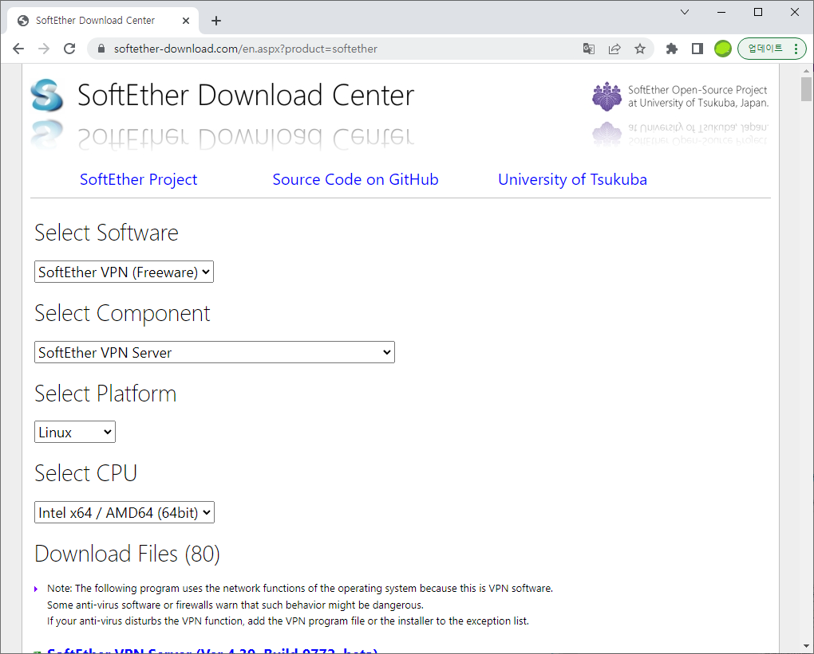

# 리눅스 서버에 VPN 서버 세팅하기

기존에 Softether VPN 을 이용하여 VPN 세팅을 진행하였다. 윈도우를 그냥 바로 서버로 사용하여 VPN을 실행했는데, 생각보다 CPU 자원을 많이 사용할
뿐만 아니라, CPU 때문인진 모르겠지만 연결 후 시간이 지나면 자동으로 연결이 끊긴 후 다시 연결되지 않는 문제가 발생했다. 

대충 원인을 확인해보니 Softether VPN은 Virtual NAT 라는 가상의 네트워크 인터페이스를 이용해서 DHCP 서버까지 같이 제공을 해준다고 한다. 
이 방법은 사용자가 간단하게 VPN 세팅을 할 수 있지만, 아무래도 가상으로 DHCP서버와 허브까지 같이 동작하다보니 호스트 자원을 상당히 많이 사용하게 되어
속도가 많이 느려지게 된다고 한다. 그래서 보통은 로컬 브릿지 방식을 이용해서 세팅을 진행하는데, 이방법은 속도는 잘 나오지만 초반 세팅이 조금 복잡하다고 한다.

기왕 이렇게 된거 서버에 VPN을 설치하면서, 로컬 브릿지까지 같이 세팅하는 방법을 작성해볼까 한다. 일단 여기서는 설치 및 실행까지만 다뤄본다.

#### 참고 URL
* <https://damoa-nawa.tistory.com/89>
* <https://tatademengxiang.xyz/2022/09/08/rocky-linux-8上softether-vpn-server安装/>

### 세팅환경
세팅은 Rocky Linux 9 버전에서 진행한다. 기존 CentOS를 거의 동일할 뿐만 아니라, 요즘 이 리눅스버전을 사용하는 곳이 늘어나고 있어서 여기에 세팅을
진행해본다.

### 설치
파일은 wget을 이용하여 다운받으면 되는데, 원하는 버전을 다운 받으려면 아래와 같이 하면 된다.
먼저 [softether VPN 다운로드 사이트](https://www.softether-download.com/en.aspx?product=softether) 에 접속한다.\
그 후 아래와 같이 자신이 설치할 컴퓨터에 맞는 사양을 선택한 후,



다운 받을 파일을 우클릭하여 링크복사를 해준다.


그 후 wget을 이용하여 복사한 해당 파일의 링크를 입력하여 파일을 받아주면 된다.
```shell
[root@localhost ~]# wget https://github.com/SoftEtherVPN/SoftEtherVPN_Stable/releases/download/v4.38-9760-rtm/softether-vpnserver-v4.38-9760-rtm-2021.08.17-linux-x64-64bit.tar.gz
```

dnf 를 이용하여 필요한 라이브러리들을 다운받아준다.
```shell
[root@localhost ~]# dnf install gcc zlib-devel openssl-devel readline-devel ncurses-devel
```

라이브러리 설치가 완료 됐으면 압축을 풀어준다. 압축을 풀기전에 나는 먼저 svc 디렉토리로 압축파일을 옮겨주었다. 그리고 바로 압축을 풀어준다.
```shell
[root@localhost ~]# mv softether-vpnserver-v4.38-9760-rtm-2021.08.17-linux-x64-64bit.tar.gz /svc
[root@localhost ~]# cd /svc
# 압축 풀기
[root@localhost svc]# tar -xzvf softether-vpnserver-v4.38-9760-rtm-2021.08.17-linux-x64-64bit.tar.gz
```

압축이 다 풀리게 되면 vpnserver 라는 디렉토리에 설치파일들의 압축이 풀리게 된다.
```shell
[root@localhost svc]# ls
softether-vpnserver-v4.38-9760-rtm-2021.08.17-linux-x64-64bit.tar.gz  vpnserver
```
vpnserver 디렉토리로 이동한 후 아래와 같이 입력하면 설치가 진행된다.
```shell
[root@localhost svc]# cd vpnserver
[root@localhost vpnserver]# make
```

설치가 완료되었으면 아래 명령어로 서버를 실행시켜준다.
```shell
# Softehter VPN 서버 시작
[root@localhost vpnserver]# ./vpnserver start
The SoftEther VPN Server service has been started.

Let's get started by accessing to the following URL from your PC:

https://192.168.50.250:5555/
  or
https://192.168.50.250/

Note: IP address may vary. Specify your server's IP address.
A TLS certificate warning will appear because the server uses self signed certificate by default. That is natural. Continue with ignoring the TLS warning.
```

서버 실행까지 완료되었으면 vpncmd 파일을 실행시키자.
```shell
# 엔터엔터 눌러서 기본 세팅으로 설정
[root@localhost vpnserver]# ./vpncmd
vpncmd command - SoftEther VPN Command Line Management Utility
SoftEther VPN Command Line Management Utility (vpncmd command)
Version 4.38 Build 9760   (English)
Compiled 2021/08/17 22:32:49 by buildsan at crosswin
Copyright (c) SoftEther VPN Project. All Rights Reserved.

By using vpncmd program, the following can be achieved.

1. Management of VPN Server or VPN Bridge
2. Management of VPN Client
3. Use of VPN Tools (certificate creation and Network Traffic Speed Test Tool)

#1번 선택
Select 1, 2 or 3: 1

Specify the host name or IP address of the computer that the destination VPN Server or VPN Bridge is operating on.
By specifying according to the format 'host name:port number', you can also specify the port number.
(When the port number is unspecified, 443 is used.)
If nothing is input and the Enter key is pressed, the connection will be made to the port number 8888 of localhost (this computer).
Hostname of IP Address of Destination: #입력 없이 엔터 (기본값)

If connecting to the server by Virtual Hub Admin Mode, please input the Virtual Hub name.
If connecting by server admin mode, please press Enter without inputting anything.
Specify Virtual Hub Name: #입력 없이 엔터 (기본값)
Connection has been established with VPN Server "localhost" (port 443).

You have administrator privileges for the entire VPN Server.
```

정상적으로 세팅이 완료되었으면 아래와 같이 VPN Server cmd가 나타나게 된다. VPN 서버에 압호를 세팅해준다.
```shell
#서버 패스워드 세팅
VPN Server>ServerPasswordSet
ServerPasswordSet command - Set VPN Server Administrator Password
Please enter the password. To cancel press the Ctrl+D key.

Password: **********
Confirm input: **********


The command completed successfully.

VPN Server>
```

다음으로 허브를 생성해준다. 나는 SVPN이란 이름의 허브를 생성해주었다.
```shell
#SVPN 이라는 허브 생성
VPN Server>HubCreate SVPN
HubCreate command - Create New Virtual Hub
Please enter the password. To cancel press the Ctrl+D key.

Password: **********
Confirm input: **********


The command completed successfully.

VPN Server>
```

허브 세팅까지 완료되었다면 SVPN 허브로 접속해준다. 접속 후 SecureNat 사용을 설정해준다. 여기서는 정상 동작 확인을 위해 SecureNat 설정을 켜주었는데,
어짜피 나는 나중에 브릿지 세팅으로 변경할 것이기 때문에 이부분은 크게 신경쓰지 않아도 된다.
```shell
# SVPN 허브로 접속 및 SecureNat 사용 설정
VPN Server>Hub SVPN
Hub command - Select Virtual Hub to Manage
The Virtual Hub "SVPN" has been selected.
The command completed successfully.

VPN Server/SVPN>SecureNatEnable
SecureNatEnable command - Enable the Virtual NAT and DHCP Server Function (SecureNat Function)
The command completed successfully.

VPN Server/SVPN>
```

마지막으로 접속할 사용자를 세팅해준다. 이 단계가 끝나면 여기서 생성한 아이디와 패스워드를 이용하여 VPN 접속이 가능해지게 된다.
```shell
# VPN 접속 사용자 세팅
VPN Server/SVPN>UserCreate hjchoi
UserCreate command - Create User
Assigned Group Name:

User Full Name:

User Description:

The command completed successfully.

VPN Server/SVPN>UserPasswordSet hjchoi
UserPasswordSet command - Set Password Authentication for User Auth Type and Set Password
Please enter the password. To cancel press the Ctrl+D key.

Password: **********
Confirm input: **********


The command completed successfully.

VPN Server/SVPN>
```

마지막으로 포트들을 열어주어야 하는데, TCP 5555, UDP 500 4500 1701을 열어주어야 정상적으로 VPN 접속이 가능해지게 된다.