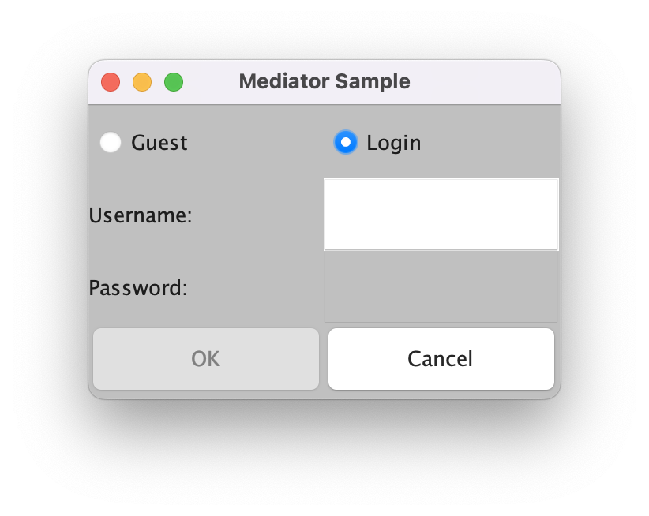

# Mediator 패턴

### Mediator 패턴이란
Mediator 이란 단어는 '조정자', '중개자'라는 뜻을 갖고 있다. 이 패턴은 영향이 생길만한 상황이 생기면 중개인에게 해당 상황을 알리고 중개인의 지시대로 행동한다.\
중개인은 올라온 상황들에 대해 판단을 진행한 후, 알맞은 결과를 각 클래스에 내려준다. 간단하게 보면 어느 모임에서 모임원 몇명이 분쟁이 생길만한 일이 생기면 \
해당 문제를 아무 관련이 없는 모임장에게 알려주고 모임장이 해당 문제를 파악한 후 알맞은 해결책을 각 모임원들에게 알려준다고 보면 된다.\
예제코드로 한번 알아보자.

### 예제코드
이번 예제는 이름과 패스워드를 입력하는 로그인창이다. 이 예제의 기능은 다음과 같다.
> 게스트 로그인인지 사용자 로그인인지를 선택\
> 사용자 로그인인 경우 Username 과 Password 를 받는다.\
> 로그인을 하려면 OK를, 취소하려면 Cancel 버튼을 누른다.

위 기능들만 본다면 간단한 예제이지만, 아래처럼 세부적인 예외사항들이 들어가면 이야기가 달라진다.
> 게스트 로그인 선택시엔 사용자명과 패스워드 칸 비활성화\
> 사용자 로그인 선택시엔 사용자명과 패스워드 칸 활성화\
> 사용자명 공란일 시 패스워드칸 비활성화\
> 사용자명에 한글자라도 들어가면 패스워드칸 활성화\
> 사용자명과 패스워드 모두 입력되어있을 때만 OK 버튼 활성화. 이외에는 비활성화\
> Cancel 버튼은 항상 활성화\

예제에서는 라디오버튼, 텍스트 필드 그리고 버튼이 모두 각각 다른 클래스로 이루어져 있다. 이렇게 될 경우 위의 로직들을 클래스마다 분산시키면 개발 난이도가 \
상당히 올라가게 된다. 오브젝트들이 서로 연관 되어있기 때문이다. 이렇게 다수 오브젝트들의 관계를 조정해야 할때 바로 Mediator 패턴을 사용하면 된다.\
표시 컨트롤에 대한 로직들을 모두 중개인 안에 개발하고, 오브젝트들이 중개인과만 통신하면 되는 것이다.

```java
public interface Mediator {
    public abstract void createColleagues();
    public abstract void colleagueChanged();
}
```
Mediator 인터페이스는 중개인 역할을 한다. 중개인 역할을 하는 클래스들은 이 인터페이스를 상속받아서 구현된다. createColleagues 메소드는 Mediator 가\
관리하는 회원을 생성하는 메소드이다. colleagueChanged 메소드는 중개인에 대한 상담에 해당하며, 상태값등이 변할 때 호출된다.

```java
public interface Colleague {
    public abstract void setMediator(Mediator mediator);
    public abstract void setColleagueEnabled(boolean enabled);
}
```
Colleague 인터페이스는 중개인에게 상담을 의뢰하는 회원 역할을 하는 인터페이스이다. setMediator 메소드는 중개인을 세팅하는 메소드로, 로그인 프레임이 \
호출하는 메소드이다. setColleagueEnabled 는 중개인이 내리는 지시에 해당한다. enabled 값이 true 면 자기자신을 유효상태, false 면 무효로 판단한다. \
이 메소드는 중개인의 판단에 따라 결정된다. 여기서는 Mediator 인터페이스에 상태값이 변하는 메소드(colleagueChanged)를 두었고, Colleague 쪽에\
중개인의 지시메소드(setColleagueEnabled)를 두었지만, 이는 어플리케이션에 따라 어디 위치에 둘 지 달라질 수 있다.

```java
import java.awt.Button;

public class ColleagueButton extends Button implements Colleague {
    private Mediator mediator;
    
    public ColleagueButton(String caption){
        super(caption);
    }
    
    public void setMediator(Mediator mediator){
        this.mediator = mediator;
    }
    
    public void setColleagueEnabled(boolean enabled){
        setEnabled(enabled);
    }
}
```
ColleagueButton 클래스는 Button 클래스의 하위 클래스면서 Colleague 인터페이스를 구체화하는 클래스이다. mediator 필드는 setMediator 에서 넘어온\
Mediator 오브젝트를 저장해준다. setColleagueEnabled는 JAVA GUI에 정의되어있는 setEnabled 메소드를 호출하여 유효와 무효를 설정한다.
setEnabled(true) 면 버튼이 활성화 되지만, setEnabled(false)면 버튼이 비활성화된다.

```java
import java.awt.TextField;
import java.awt.Color;
import java.awt.event.TextListener;
import java.awt.event.TextEvent;

public class ColleagueTextField extends TextField implements TextListener, Colleague{
    private Mediator mediator;
    
    public ColleagueTextField(String text, int columns){
        super(text, columns);
    }
    
    public void setMediator(Mediator mediator){
        this.mediator = mediator;
    }
    
    public void setColleagueEnabled(boolean enabled){
        setEnabled(enabled);
        setBackground(enabled ? Color.white:Color.lightGray);
    }
    
    public void textValueChanged(TextEvent e){
        mediator.colleagueChanged();
    }
}
```
ColleagueTextField 클래스는 ColleagueButton 처럼 TextField 클래스의 하위클래스이다. 또한 TextListener 인터페이스도 같이 구현하고 있다.\
이 클래스는 텍스트의 내용이 변했을 때 textValueChanged 에서 변화를 감지하기 위해서이다.\
setColleagueEnabled 메소드는 두개의 메소드를 호출하는데, setEnabled 메소드는 위에서 사용한 기능과 동일하며, setBackground는 유효값일 경우\
배경이 흰색, 무효일 경우 밝은회색으로 표시한다.\
textValueChanged 는 위에서 설명한 것 처럼 텍스트의 내용이 변했을 때 감지하는 메소드인데, 변경을 감지하면 Mediator의 colleagueChanged 메소드를\
호출하여 변화를 알린다.

```java
import java.awt.Checkbox;
import java.awt.CheckboxGroup;
import java.awt.event.ItemListener;
import java.awt.event.ItemEvent;

public class ColleagueCheckbox extends Checkbox implements ItemListener,Colleague {
    private Mediator mediator;

    public ColleagueCheckbox(String caption, CheckboxGroup group, boolean state) {
        super(caption, group, state);
    }

    public void setMediator(Mediator mediator) {
        this.mediator = mediator;
    }

    public void setColleagueEnabled(boolean enabled) {
        setEnabled(enabled);
    }

    public void itemStateChanged(ItemEvent e) {
        mediator.colleagueChanged();
    }
}
```
ColleagueCheckbox도 위의 두 클래스와 거의 유사하다. 예제에서는 체크박스 대신 라디오버튼이 사용된다(CheckboxGroup 을 이용)

```java
import java.awt.Frame;
import java.awt.Label;
import java.awt.Color;
import java.awt.CheckboxGroup;
import java.awt.GridLayout;
import java.awt.event.ActionListener;
import java.awt.event.ActionEvent;

public class LoginFrame extends Frame implements ActionListener, Mediator {
    private ColleagueCheckbox checkGuest;
    private ColleagueCheckbox checkLogin;
    private ColleagueTextField textUser;
    private ColleagueTextField textPass;
    private ColleagueButton buttonOk;
    private ColleagueButton buttonCancel;
    
    public LoginFrame(String title){
        super(title);
        setBackground(Color.lightGray);
        setLayout(new GridLayout(4, 2));
        createColleagues();
        add(checkGuest);
        add(checkLogin);
        add(new Label("Username: "));
        add(textUser);
        add(new Label("Password: "));
        add(textPass);
        add(buttonOk);
        add(buttonCancel);
        colleagueChanged();
        pack();
        show();
    }
    
    public void createColleagues(){
        CheckboxGroup g = new CheckboxGroup();
        checkGuest = new ColleagueCheckbox("Guest", g, true);
        checkLogin = new ColleagueCheckbox("Login", g, false);
        textUser = new ColleagueTextField("", 10);
        textPass = new ColleagueTextField("", 10);
        textPass.setEchoChar('*');
        buttonOk = new ColleagueButton("OK");
        buttonCancel = new ColleagueButton("Cancel");
        
        checkGuest.setMediator(this);
        checkLogin.setMediator(this);
        textUser.setMediator(this);
        textPass.setMediator(this);
        buttonOk.setMediator(this);
        buttonCancel.setMediator(this);
        
        checkGuest.addItemListener(checkGuest);
        checkLogin.addItemListener(checkLogin);
        textUser.addTextListener(textUser);
        textPass.addTextListener(textPass);
        buttonOk.addActionListener(this);
        buttonCancel.addActionListener(this);
    }
    
    public void colleagueChanged(){
        if(checkGuest.getState()){
            textUser.setColleagueEnabled(false);
            textPass.setColleagueEnabled(false);
            buttonOk.setColleagueEnabled(true);
        } else {
            textUser.setColleagueEnabled(true);
            userpassChanged();
        }
    }
    
    private void userpassChanged(){
        if(textUser.getText().length() > 0){
            textPass.setColleagueEnabled(true);
            if(textPass.getText().length() > 0){
                buttonOk.setColleagueEnabled(true);
            }else{
                buttonOk.setColleagueEnabled(false);
            }
        }else{
            textPass.setColleagueEnabled(false);
            buttonOk.setColleagueEnabled(false);
        }
    }
    public void actionPerformed(ActionEvent e){
        System.out.println(e.toString());
        System.exit(0);
    }
}
```
LoginFrame 클래스는 Frame 클래스의 하위 클래스로서 Mediator 인터페이스를 구현하고 있다. 위의 생성자에서는 다음과 같은 일을 하고 있다.

> 배경색의 설정\
> 레이아웃 매니저의 설정(내부 윈도우를 세로 4 X 가로 2로 배치한다)\
> createColleagues 메소드에서 Colleague 생성\
> Colleague의 배치\
> 초기상태의 설정\
> 표시

createColleagues 메소드는 이 창을 만드는데 필요한 Colleague들을 생성하고 그걸 변수에 저장하고 있다. 또 각 변수마다 setMediator를 호출하여 중개인 \
세팅을 진행해준다. createColleagues 메소드에서는 각 Listener의 설정도 수행한다. 이는 각각 awt의 프레임워크로부터 적절하게 호출되도록 하기 위함이다.\
\
여기서 제일 중요한 메소드는 colleagueChanged() 이다. 여기서는 각 조건에 따른 표시 설정을 하게 된다. 예제에서 만들었던 ColleagueButton,\ 
ColleagueTextField, ColleagueCheckbox 모두 유효/무효를 세팅해주는 메소드만 있을 뿐 조건에 따라 처리하는 로직은 따로 존재하지 않는다.\
모든 Collegue의 조건에 대한 로직은 colleagueChanged 메소드에서 처리하게 되는 것이다.\

```java
public class Main{
    public static void main(String[] args){
        new LoginFrame("Mediator Sample");
    }
}
```
Main 클래스에서는 LoginFrame 클래스의 인스턴스를 생성한다. 

완성된 로그인창은 아래와 같다.


### 패턴 사용시 고려해볼 점
Mediator 에서 고려해볼 점은 로직 분산에 대한 점이다. 예제 프로그램을 보면 LoginFrame 클래스 안의 colleagueChanged 에서 복잡한 로직을 처리한다. \
만약 이 조건에 따른 로직처리 중 버그가 발생하면 어떻게 될까? 물론 colleagueChanged 메소드 안에서 디버그를 실행해보면 된다. 만약에 로직이 각 클래스마다\
분산되어 있으면 디버그가 상당히 어렵게 될 것이다. 보통 우리는 오브젝트를 분산시키려고 하지만 이처럼 한 곳에 모아야 할 것은 모으는 것이 오히려 더 현명한 방법이\
될 수도 있다.\
\
이 패턴에서는 재활용 할 수 있는 클래스와 재활용이 어려운 클래스가 있는데, 만약 우리가 새로운 창을 하나 만든다고 가정해보자. 여기서 우리는 ColleagueButton,\
ColleagueTextField, ColleagueCheckbox는 새로운 창에서도 사용이 가능하다. 이 클래스들의 역할은 단지 버튼, 텍스트 필드, 버튼을 구성하는 클래스들로\
특별히 어디에 의존하는 클래스들이 아니기 때문에 재이용이 가능하다. 반대로 LoginFrame 클래스는 로그인 창을 만들기 위한 클래스인데, 이는 로그인 창 구성에\
의존적이기 때문에 재이용이 어렵다. 