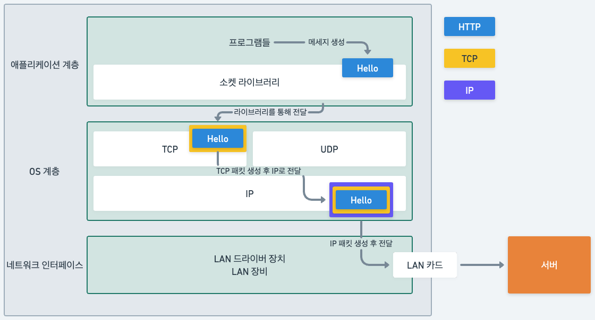

# TCP, UDP

앞에서 이야기했던 문제들은 TCP가 해결해줄 수 있음.

TCP는 아래와 같이 동작함

TCP와 IP 패킷엔 다음과 같은 정보가 들어가 있다.\

### TCP
전송 제어 프로토콜 (Transmission Control Protocol)

TCP의 특징
* 연결지향 - TCP 3 way handshake (가상연결)
* 데이터 전달 보증
* 순서 보장

그렇기에 신뢰할 수 있는 프로토콜이며 현재 대부분 TCP 사용.

**3 way handshake**

TCP 프로토콜로 연결 시 다음과 같은 순서를 따른다.
1. 클라이언트가 서버로 SYN(synchronize) 메세지를 보냄
2. 서버는 SYN 메세지를 받으면 클라이언트에게 잘 받았다는 의미로 SYN+ACK(acknowledge) 메세지를 보냄
3. 클라이언트에서 서버측에서 위 메세지를 받으면 다시 ACK 메세지를 보냄.
4. 데이터 전송

SYN은 접속 요청, ACK은 요청 수락이라고 알면 된다. 참고로 요즘은 최적화로 인해 3의 ACK와 함께 데이터를 전송할 수 있음.\
위의 연결은 실제 물리적인 연결이 아니다! 물리 연결은 서로의 랜선을 꽂아 연결하는 것이며, TCP 프로토콜은 서로 연결 되었다고 논리적으로만 확인하는 단계이다.

**데이터 전달 보증**

단순하게 서버에서 주는 응답값이라고 생각하면 된다. 
1. 클라이언트가 메세지를 보낸다.
2. 서버는 메세지를 잘 받았다는 응답을 보내준다.

**순서 보장**

패킷의 순서를 보장한다. 
1. 패킷의 크기가 커 나눠 보냈다고 가정.
2. 만약 패킷의 순서가 1,2,3 으로 안오고 1,3,2로 왔다고 가정.
3. 서버는 1 이후의 패킷은 버리고 2부터 다시 클라이언트에게 요청.

이게 가능한 이유는 TCP 패킷에 순서 정보, 전송 제어등과 같은 정보들을 이용하여 전달하기 때문이다.

### UDP

UDP는 사용자 데이터그램 프로토콜임 (User Datagram Protocol)
* IP 패킷과 거의 동일하며 기능이 거의 없음
* 위에서 알아본 TCP의 기능은 하나도 없음.
* 데이터 전달 및 순서 보장이 안되지만, 단순하며 빠르다.
* 여기서 IP 패킷과 다른점은 **PORT**가 있다는 것이다.
  * PORT란 하나의 IP에서 여러 패킷을 받아 처리하는 것이라고 보면 됨.
* 요즘은 다시 UDP가 뜨고 있음.

UDP의 장점.
* 빠른 속도
* TCP와 달리 사용자가 최적화 시킬 수 있음.
  * TCP의 경우 인터넷이 TCP기반으로 동작하기 때문에 커스텀이 불가능하다.

